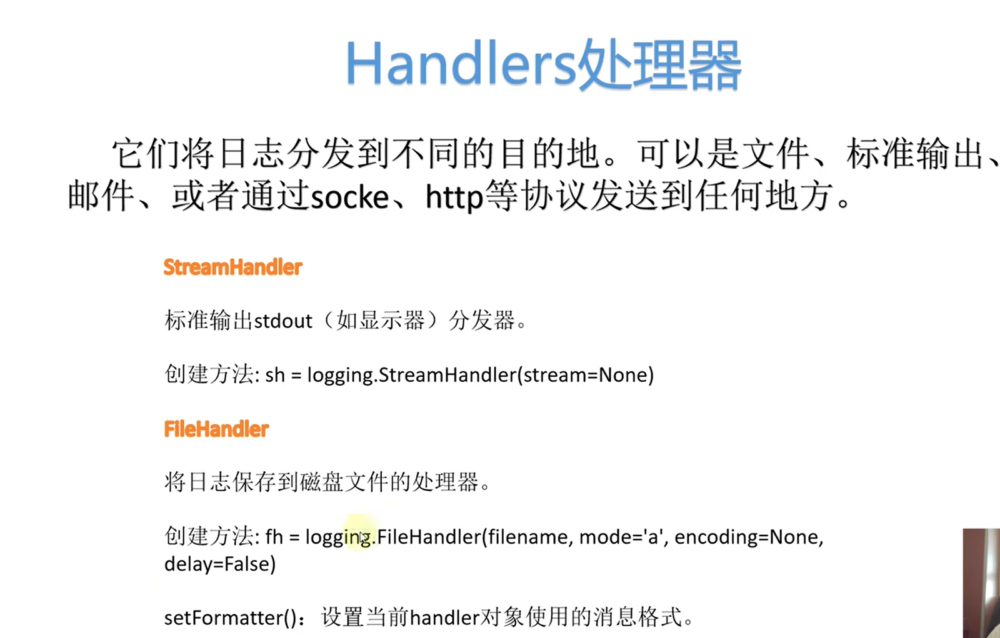

# python-日志管理

## logging日志级别


默认只输出 warning以及以上的日志级别，但也可以手动指定输出的日志级别


生成日志，并输出到文件中，可以设置 写入的模式为‘w’、‘a’


三种写入的方法啊：（三种字符串化的方法）


输出格式和添加一些公共信息：


调整时间格式：

## logging高级功能 


logging 实例相当一一支笔，负责记录




常见的几个handlers


```python
# 用编程的方式，（更加高级的写法）

```


applog仅仅是记录器的名字，注意，如果想要让 handler中设置的级别起作用，那么我们得在创建 logger时设置，logger.setlevel(logging.DEBUG)即最低级别


在设置formatter时可以在s的前面写一个数字，以让对齐！！！，就是字符串对齐的知识


结果（console）：


结果（file）：


## 以配置文件方式


