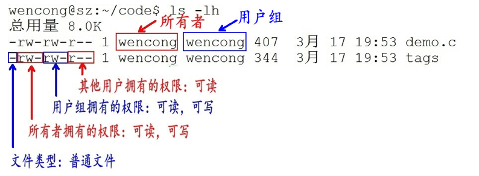

# 学习linux随记

## 命令行小技巧

### 历史命令

一方面可以可以使用上箭头调出历史命令

==还可以在 命令行中使用 CTRL+R快捷方式（根据关键词检索距离最近的历史指令==  

### 行内命令

CTRL + a ： 转到行首

CTRL + e：跳转到行尾

CTRL + u：删除光标前的内容

ctrl + x + u：撤销（用的很少）

ctrl + l ： 清屏

### 命令行窗口

CTRL + ALT + T :快速打开命令行

CTRL + SHEFT + T：在打开一个命令行

安装terminator 

sudo apt install terminator

设置配置文件：

~/.config/terminator/config

```python
[global_config]
  title_font = Ubuntu Mono 11[keybindings]
[keybindings]
[layouts]
  [[default]]
    [[[child1]]]
      parent = window0
      type = Terminal
    [[[window0]]]
      parent = ""
      type = Window
[plugins]
[profiles]
  [[default]]
    background_color = "#002b36"
    background_darkness = 0.91
    background_image = None
    background_type = transparent
    font = Ubuntu Mono 11
    foreground_color = "#e0f0f1"
    show_titlebar = False
    use_system_font = False

```

terminator快捷键：

```
ctrl + alt + t：打开命令行
ctrl + sheft + t：再打开一个命令行
ctrl + sheft + o：水平分割
ctrl + sheft + w：关闭一个分割
ctrl + sheft + q：关闭整个命令行
ctrl + table ： 切换分割


Alt + G：开启多终端广播输入
Alt + O：关闭广播输入
```

## 常见命令

### ls

```shell
ls
-l:显示详细信息 ，等价于 ll
-a:显示所有文件
-h:以人性化方式显示文件大小
```


注：一般命令行涉及到具体文件的指令都可以使用==通配符== 

### 通配符

```python
*:任意长度字符
?：任意一个字符
[]:字符组，表示匹配字符组中任意一个
[a-z]:表示匹配a-z任意一个字符
！！！-在[]之外将失去通配符的效果
！！！若不想使用通配符，只需要使用/转义一下就行
```

### stat

首先了解一下什么是inode和block

#### inode 和 block 概述

文件是存储在硬盘上的，硬盘的最小存储单位叫做扇区sector，每个扇区存储512字节。操作系统读取硬盘的时候，不会一个个扇区地读取，这样效率太低，而是一次性连续读取多个扇区，即一次性读取一个块block。这种由多个扇区组成的块，是文件存取的最小单位。块的大小，最常见的是4KB，即连续八个sector组成一个block。

文件数据存储在块中，那么还必须找到一个地方存储文件的元信息，比如文件的创建者、文件的创建日期、文件的大小等等。这种存储文件元信息的区域就叫做inode，中文译名为索引节点，也叫i节点。因此，一个文件必须占用一个inode，但至少占用一个block。

stat + 文件：即可查看文件相关情况

### 文件权限

**读权限（r）** ：对于文件，具有读取文件内容的权限；对于目录，具有浏览目录的权限。

**写权限（w）** ：对于文件，具有修改文件内容的权限；对于目录，具有删除、移动目录内文件的权限。

**可执行权限（x）**： 对于文件，具有执行文件的权限；对于目录，该用户具有进入目录的权限



对于第一个占位符，表示文件类型：

d” 代表文件夹
“-” 代表普通文件
“c” 代表硬件字符设备
“b” 代表硬件块设备
“s”表示管道文件
“l” 代表软链接文件

#### chmod  u/g/o/a  +/- rwx

u	user 表示该文件的所有者
g	group 表示与该文件的所有者属于同一组( group )者，即用户组
o	other 表示其他以外的人
a	all 表示这三者皆是

+：增加权限

-：撤销权限

=：设定权限

r	读取权限，数字代号为 “4”
w	写入权限，数字代号为 “2”
x	执行权限，数字代号为 “1”

注意：如果想递归所有目录加上相同权限，需要加上参数“ -R ”。 如：chmod 777 test/ -R 递归 test 目录下所有文件加 777 权限

```shell
# 使用举例
chmod u=5,g=5,o=5 a.txt -R
chmod 777 a.txt -R
chmod u+r g-r o+x a.txt -R

```

### 简单的文件查看

#### cat

-n ：显示文件的时候带上行号

#### tac

从最后一行，从后往前显示

#### more/less

分屏显示（用的比较少）

### **>** 输出重定向

**>>**表示追加

**>**会覆盖之前的内容

### **|**  管道命令

管道命令**仅处理标准输出**，对于标准错误输出，将忽略

管道命令**右边命令，必须能够接收标准输入流命令**才行，否则传递过程中数据会抛弃

因此管道符的功能显而易见了，就是将标准输出转为标准输入：

#### 标准输入以及标准输入

这两个被linux系统当成一个设备文件放置在/dev目录下，一个为stdin一个为stdout，分别用于接收控制台输入和输出到控制台

在Linux中，标准输入（stdin）、标准输出（stdout）和标准错误（stderr）是用于处理输入输出的三个重要的流。它们是命令行程序的核心概念，用于处理数据的传输、显示和错误报告。让我们详细讲解一下标准输入和标准输出流：

**标准输入（stdin）：** 标准输入是程序从用户或其他程序读取数据的途径。在Linux中，通常情况下，标准输入是终端（也就是用户在命令行输入的内容）。程序可以从标准输入中读取用户提供的数据，然后进行处理。

例如，假设你有一个名为`my_program`的可执行文件，它可以从标准输入读取数据。你可以通过以下方式将标准输入重定向到一个文件中：

```
bashCopy code
./my_program < input.txt

echo abc  > /dev/stdout
```

这将使`my_program`从名为`input.txt`的文件中读取数据，而不是从终端读取。

**标准输出（stdout）：** 标准输出是程序将结果或信息输出到用户或其他程序的途径。默认情况下，标准输出会显示在终端上。例如，当你在终端运行一个命令时，它的输出通常会显示在终端上。

你可以将标准输出重定向到文件中，将程序的输出保存到文件中，而不在终端上显示。例如：

```
bashCopy code
./my_program > output.txt
```

这将把`my_program`的输出写入到名为`output.txt`的文件中。

### pwd

显示当前所在哪里

### ln

软链接：ln -s 源文件 链接文件

硬链接：ln 源文件 链接文件

软链接类似于Windows下的快捷方式，如果软链接文件和源文件不在同一个目录，源文件要使用绝对路径，不能使用相对路径。

硬链接只能链接普通文件不能链接目录。 两个文件占用相同大小的硬盘空间，即使删除了源文件，链接文件还是存在，所以-s选项是更常见的形式。==硬链接实际上是共享同一个indoe== 


### grep

grep [options][-e PATTERN | -f FILE] -e pattern -v pattern [file1、file2...]

注意：-e参数与-v参数不能同时使用，但是同时可以使用多个-v、-e参数

### find 范围 选项

查找文件指令，没啥好说的，挺简单的使用

选项：

ind ./ -name test.sh	查找当前目录下所有名为test.sh的文件
find ./ -name ‘*.sh’	查找当前目录下所有后缀为.sh的文件
find ./ -name “[A-Z]*”	查找当前目录下所有以大写字母开头的文件
find /tmp -size 2M	查找在/tmp 目录下等于2M的文件
find /tmp -size +2M	查找在/tmp 目录下大于2M的文件
find /tmp -size -2M	查找在/tmp 目录下小于2M的文件
find ./ -size +4k -size -5M	查找当前目录下大于4k，小于5M的文件
find ./ -perm 0777	查找当前目录下权限为 777 的文件或目录

### which

查看命令位置


### 关于解压缩

的命令太多了，这里就不写了，需要时候去查一下就行

### netstat

可以让你查看linux当前用户进程所使用的传输层连接状态

参数

-n：以ip形式而不是域名

-l：监视当前进程使用的socket

-t：tcp连接

-u：udp连接

-p：显示正在使用socket的程序名

### wc

统计字数

```shell
wc [-lwm] [filename]
-l: 统计行数
-w：统计英文单词
-m：统计字符数
python@xxx:~$ wc -l /etc/passwd
49 /etc/passwd
python@xxx:~$ wc -w /etc/passwd
81 /etc/passwd
python@xxx:~$ wc -m /etc/passwd
2696 /etc/passwd
!!!!! wc 后面若只有-，则表示从标准输入stdin中获取输入
```

如果不指定参数，3 个数字分别表示testfile文件的行数、单词数，以及该文件的字节数，就是啥都统计

### cut

根据特定的分行符，来选取特定的列

选项与参数：

```shell
-d  ：后面接分隔字符。与 -f 一起使用；
-f  ：依据 -d 的分隔字符将一段信息分割成为数段，用 -f 取出第几段的意思；
-c  ：以字符 (characters) 的单位取出固定字符区间；
```


cut以行为单位，根据分隔符把行分成若干列，这样就可以指定选取哪些列了。

cut -d '分隔字符' -f 选取的列数

```shell
echo $PATH|cut -d ':' -f 2  	--选取第2列
echo $PATH|cut -d ':' -f 3,5  	--选取第3列和第5列
echo $PATH|cut -d ':' -f 3-5  	--选取第3列到第5列
echo $PATH|cut -d ':' -f 3-   	--选取第3列到最后1列
echo $PATH|cut -d ':' -f 1-3,5	--选取第1到第3列还有第5列
```


