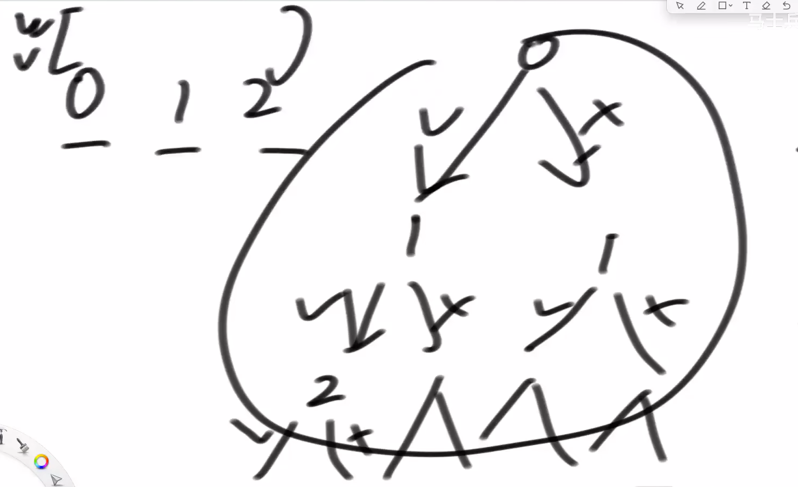
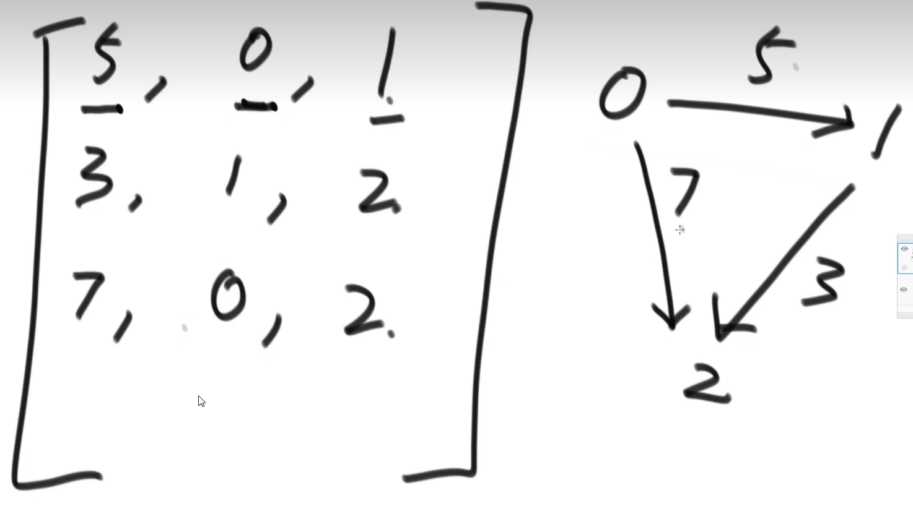

# 动态规划

1.首先拿斐波那契序列的求解来举例，一般的递归方法求解实际上很费空间

2.因此我们可以使用动态规划，----动态规划的本质就是 --- 缓存值--

```c++
int fun(int n){
    int pre1=1,pre2=1,index=2,value;
    if(n == 1){
        return pre1;
    }
    if(n == 2){
        return pre2;
    }
    while(now < n){
        valude = pre1 + pre2;
        pre1 = pre2;
        pre2 = value;
    }
    return value;
}
```

3.没思路怎么办：

老师给出的方法：先自己尝试

```c++
// 题目：机器人走路：参数：位置范围1~n ，起始位置start，每次能走一步，需要走
// 步走向aim位置

int countWays1(int n, int start, int aim, int k){
    // 调用过程函数（过程函数应该是一个递归函数）
}
// 这个尝试非常符合我们的正常思维
int process1(int n, int cur, int aim, int rest){
    if(rest == 0){ // 剩余0步，不能再走了
        return cur == end:1?0;
    }
    if(cur == 1){ // 到达了第一个位置，且剩余有步数
        return countWays(n,2,aim,rest-1);
    }
    if(cur == n){ // 到达最后的位置，且有剩余步数
        return countWays(n,n-1,aim,rest-1);
    }
    return countWays(n,cur+1,aim,rest-1) + countWays(n,cur-1,aim,rest-1);
}
```

```c++
// 现在我们想对上述的算法进行优化

// 首先，联想到斐波那契数列，递归的调用应该会涉及到很多的，重复计算！！！！！出现重复解的暴力递可以优化！！！

// 如果每个子问题都是不同的，那我们优化不了，也不能优化！！！，因为动态规划的本质就是缓存！！！！

// So，我们首先需要画一个树形结构图，看看递归调用！！！！！

// 我们会很轻易发现，key = {cur，rest}，这要这俩参数已确定，函数的返回值就必然确定了！！！！
// 因此我们就知道要缓存啥了！！！
```

```c++
// 题目：机器人走路：参数：位置范围1~n ，起始位置start，每次能走一步，需要走
// 步走向aim位置

// cur from 1 to n
// rest from 0 to k
// 因此我们需要一个dp = [N+1][K+1]才能装下所有的状态！！！！！！！即所有的key！！！！
int countWays1(int n, int start, int aim, int k){
    int dp[n+1][k+1]; // dp是一个缓存表，用来缓存之前计算过得数值，防止再计算
    for(int i=0;i<n+1;i++){
        for(int j=0;j<k+1;j++){
            dp[i][j] = -1；
        }
    }
    // 为什么要设置-1呢，是因为，-1表示这个换存值还没有计算过，如果不为-1表示这个换存值已经计算过了
}


int process2(int n, int cur, int aim, int rest ,int **dp){
    if(dp[cur][rest] != -1){
        // 缓存表命中
        return dp[cur][rest];
    }
    // 没命中，我们需要计算
    int ans = 0;
    else if(rest == 0){ // 剩余0步，不能再走了
        ans cur == end:1?0;
    }
    else if(cur == 1){ // 到达了第一个位置，且剩余有步数
        ans = countWays(n,2,aim,rest-1,dp);
    }
    else if(cut == n){ // 到达最后的位置，且有剩余步数
        ans =  countWays(n,n-1,aim,rest-1,dp);
    }
    else{
        ans = countWays(n,cur+1,aim,rest-1) + countWays(n,cur-1,aim,rest-1,dp);
    }
    // 保存缓存
    dp[cur][rest] = ans;
    return ans;
}
```

```c++
// 以上的解决方法，已经可以算作为动态规划了，因为没有重复的计算过程

// 但是，老师计算说以上是一种  从顶到下的动态规划，或者说是 记忆化搜索（空间换时间）

// 当然动态规划也可以有省空间的
```

```c++
// 下面我们进行再一次优化算法（本质就是填表）
对于具体的缓存表，其实每个位置之间是有关系的，特别是从下往上！！！

列表示rest ，行表示cur；
（1）// 按照最原始的递归方法进行分析
// 递归方法的base case告诉我们，当rest = 0时，只有cur==aim时才会返回1，否则都是0。因此第0列仅有一个位置为1；
（2）// 关注我们的目标，dp的【start】【K】的位置是我们最终想要得到的
（3）//查看普遍位置是怎么依赖的，怎么看-----继续看暴力递归！！！！我们分析暴力递归的第二个if条件，当cur=1时，其值依赖左下角位置，第一行的位置依赖左下角的值。
（3）// 分析暴力递归的第三个if，当cur=n时，其值等于左上角的值
（4）// 分析最后一个if语句，为普遍位置！！！其值依赖于左上角的值加上左下角的值

// 以上，我们分析完毕，位置的依赖关系

// 下面分析将如何填表

// 一列一列的填写，非常简单！！！！！！！！！，也就是说除了第一列，每个位置上的值等于左上加左下的值，若没有坐下或者左上，就看做0进行相加！！！！！！

// 下面我们可以下代码进行填表，最后结果直接由表填写！！！！！

！！！ 以上填表的过程就是状态转移！！！！！
状态转移不是原因而是结果！！！！！

```

```c++
// 题目：机器人走路：参数：位置范围1~n ，起始位置start，每次能走一步，需要走
// 步走向aim位置

int countWays3(int n, int start, int aim, int k){
    int dp[n+1][k+1]; //最大到n，最大到k
    // 直接开始填表(因为第一维度没有0位置，因此第一行废弃不使用！)
    // 暴力递归的base case
    for(int i=1;i<=n;i++){
        dp[i][0] = 0;
        if(i == aim){
            dp[i][0] = 1;
        }
    }
    // 根据以上分析的 转台转移来填表
    for(int i=1;i<=k;i++){
        for(int j=1;j<=n;j++){
            if(j == 1){
                dp[j][i] = dp[j+1][i-1];
            }
            if(j == n){
                dp[j][i] = dp[j-1][i-1];
            }
            else{
                dp = dp[j-1][i-1]+dp[j+1][i-1];
            }
        }
    }
    return dp[start][K];
}

```

4.先手后手只能从数组的最左或最右边拿牌，牌上有记录分数，求当牌拿完之后，先手后手分别为多少分，假设先手，后手都绝顶聪明！！！！！！！

5.背包问题

之前说过，动态规划问题的最初是 就是 “尝试！！！”（尝试是为暴力递归做基础！！！）

但是有时候就是不会尝试！！！！

方法：==从左往右== ，尝试法：

就拿背包问题来说：int weight = {1,4,1234,7,345,7},int value = {12,4,3,1,6,9}，再之后我们定义一个最大可携带重量maxWeight，求解可以携带的最大价值货物！！

尝试：、

很简单，实际上就是把所有的货物从左往右，分别进行取与不取，最后进行，这样其实就是把所有的可能都尝试了一遍，实现了暴力递归！！！！

```c++
int maxValue(int *w,int *v, int bag){
    // 返回值为当前最大容量
    
    // 有一个误区我们需要调整，就是写这种递归函数，其实都是需要调用一个真正的递归函数的，maxValue对递归函数进行一个封装，内层process函数实际上负责真正的递归，因为外部直接的参数可能并不适合用于递归！！！
    // 这个函数我们称之为 尝试函数
    process()
}
// 根据我们上述的从左往右思路，我们还需要一个额外的参数，用于从左往右遍历！！！！ 

// 从左往右的思路在这题的体现就是，利用index表示当选对index号货物是否做出选择，index以前的货物都不考虑了，直到index遍历到末尾
int process(int *w,int *v,int bag,int index,int length){
    // 已经遍历到末尾后一个元素
    if(index == length){
        return 0；
    }
   	// 选择当前货物
    p1 = 0;
    if(bag >= w[index]){
        p1 = process(int *w,int *v, bag-w[index],index+1,length)+v[index];
    }
    p2 = process(w,v,bag,index+1,length);
    return p1>p2?p1:p2;
}

```

#  一周刷爆leetcode


首先讲解一下**二分法问题**！！！

时间复杂度：logN

特点：左右两侧和要求的东西有关，并且可以确定甩掉一边


现在讲解一下： 对数器！！！


对于我们自己写出来的一个解题算法A,以及我们可以轻易使用暴力求解得出的方法B（肯定是不能通过的）,这时我们想要验证算法的有效性，我们就可以使用对数器。

设置随机样本产生器，分别交给A,B，比较他们的分别的结果，对于不一样的结果，我们可以人工干预，之后对代码进行改动，直至随机样例都能通过

其实 难点就是在于随机数发生器如何产生！！！！！！！！！！！


对应于c++:

1. **rand()：** 生成一个伪随机数，返回一个范围在 0 到 `RAND_MAX` 之间的整数。
2. **srand(unsigned int seed)：** 设置随机数生成器的种子，以便后续的 `rand()` 调用生成不同的随机数序列。通常可以使用 `time(NULL)` 作为种子，以当前时间作为基准。
3. **int rand_r(unsigned int \*seed)：** 与 `rand()` 类似，但是可以传入一个种子指针作为参数。这使得你可以在多线程环境下更安全地生成随机数。
4. 请注意，虽然这些函数在 C 语言中是标准库的一部分，但它们生成的随机数序列通常是伪随机的，不适合用于一些需要高度随机性的应用。如果你需要更高质量和更强随机性的随机数，可能需要使用更高级的随机数生成库。

```c++
# include<time.h>
# include<stdlib.h>
# include<iostream>
int main()
{	
   srand(time(0));
   // 0-1之间的小数
   double a = double(rand()) / RAND_MAX;
   // 0-N之间的整数
   int N = 100;
   int b = rand() % (N + 1);
   int num[101]={0};
   for(int i=0;i<1111111;i++){
		num[rand() % (N + 1)]++;
   }
	for(int i=0;i<100;i++){
		printf("%d\n",num[i+1]);
	}
   return 0;
}
```


就比如现在要测试一种排序算法：


递归方法求最大值！！！！！！

```c++
int getMax(int* arr,length){
   	return process(arr,0,length-1);
}

int process(int *arr,int left,int right){
    if(left == right){
        return arr[right];
    }
    int mid = left+(right-left)>>1; // 这里关于为什么使用右移的方法求中点值，是因为防止一般的方法当数组特别大的时候（left+right）数值溢出
    int leftMax = process(arr,left,mid);
    int rightMax = process(arr,mid+1,right);
    return leftMax>rightMax?leftMax:rightMax;
}
```

（其实key = {left，right}，递归其实完全依赖于这两个值，与arr本身完全没有关系）

下面讲解一下具体发生的递归行为：

 

讲解一下**master公式**来估计递归的时间复杂度：


T（表示母问题的规模） a 表示子问题的调用次数 ，T(N / b)表示子问题的规模，后一项表示，除了调用子问题外，的代码复杂度

只需要计算一层就行（ ==切记一定要均分子过程才可以使用这个公式== ，就比如对前三分之一的数据求最大值，后三分之二的数据求最大值，这样就不行，因为子问题规模不一样！！！）

将上述问题使用master公式拿来计算得到：


讲解一下归并排序，使用了递归以及master公式！！！


关于merge函数的原理如下：


```c++
void Sort(int *arr,int length){
    process()
}

void process(int *arr,int left,int right){
    if(left == right){
        return ;
    }
    int mid == left + (right - left) >> 1;
    process(arr,left,mid)；
    process(arr,mid+1,right);
    merge(arr,left,mid,right);
}
void merge(int *arr,int left,int mid,int right){
    int help[right - left+1];
    int i=0;
    int p1 = left;
    int p2= mid+1;
    while(p1 <= mid && p2 <=right){
        // 经常使用 三运算符号真的会让代码变得非常简洁！！！
        // 该简洁的时候会简洁，不该的地方，就老实写
        help[i++] = arr[p1] > arr[p2]?arr[p2++]:arr[p1++];
    }
    while(p1 <= mid){
        help[i++] = arr[p1++];
    }
    while(p2 < right){
        help[i++] = arr[p2++];
        
    }
    for(int i = left;i <= right;i++){
        arr[i] = help[i];
    }
    return ;
}
```

使用mater公式：


为什么归并排序可以将复杂度降低到：nlogn呢！！！！

本质原因那些n^2的算法都有着大量的比较，并且有大量的比较行为都被浪费了！！！！

但是对于归并排序，比较行为并没有被浪费，他可以将整个数组变得局部变得相对更加有序！！！！

没有浪费比较行为！！！比较行为没有被单纯的浪费！！！！

归并排序拓展题目


暴力解法肯定很简单，但是复杂度为n^2,但是可以更加快！！！

其实你可以从由往右看，其实就是转换一种思路，对于每个数，其右每当有一个数比他大，则他自身就要计算一次！！！！

```c++
void mergeSort(int *arr,int length){
    process()
}

int process(int *arr,int left,int right){
    if(left == right){
        return 0;
    }
    int mid == left + (right - left) >> 1;
    return process(arr,left,mid) +
    process(arr,mid+1,right) + 
    merge(arr,left,mid,right);
}
int merge(int *arr,int left,int mid,int right){
    int help[right - left+1];
    int i=0;
    int p1 = left;
    int p2= mid+1;
    int res=0;
    while(p1 <= mid && p2 <=right){
        // 经常使用 三运算符号真的会让代码变得非常简洁！！！
        // 该简洁的时候会简洁，不该的地方，就老实写
        res += arr[p1] < arr[p2]?arr[p1]*(right-p2+1):0;
        help[i++] = arr[p1] < arr[p2]?arr[p1++]:arr[p2++];
    }
    while(p1 <= mid){
        help[i++] = arr[p1++];
    }
    while(p2 < right){
        help[i++] = arr[p2++];
        
    }
    for(int i = left;i <= right;i++){
        arr[i] = help[i];
    }
    return res;
}
```


对于问题一：网友给答案的解法为快慢指针！！！

即我们有一个指正用于遍历整个数组，还有一个指正用于指示比num小的区域


```c++

```


问题升级版：用num分为三个区域，分别是比num大的区域，等于的区域，大于的区域


```c++
int splitForNUm(int *arr,int length,int num){
    int p1 = -1;
    int p2= length;
    int i=0;
    for(int i =0 ;i<p2;i++){
        if(arr[i] == num){
            continue;
        }
        else if(arr[i] < num){
            // swap a[i] a[p1++]
            p1++;
            swap(arr[p1],arr[i]);
            i++;
        }
        else{
            p2--;
            swap(arr[p2],arr[i]);
        }
    }
}
void swap(int &a,int &b){
    int t = a;
    a = b;
    b = t;
    return ;
}
```

可以理解成！！！   三指针！！！


下面可以介绍快速排序算法：


将数组根据做后一个值，根据荷兰国旗问题分成三部分，。最后将最后一个值与大于部分的第一个值做交换，这样整体就变成了三部分，之后分别对于大于部分以及小于部分做递归即可！！！

但是上述算法的复杂度为n^2,我们可以举出最差的例子，123456789即可，因此得升级为3.0版本！！！

考虑最差情况是怎么来的，划分值很偏就会导致最差情况！！如果我们可以将基准值取到刚好中间的位置，我们大概就可以使用master公式进行划分！！


3.0！！！！！！

就是随机选取一个值与最后一个值交换位置，之后再使用 交换排序2.0！！！！


```c++
# include<random>
int quickSort(int *arr,int length){
    process(arr,0,length-1);
}
void process(int *arr,int left,int right){
    // 产生随机索引
    if(left = right){
        return ;
    }
    int *res = espartition(arr,left,int right);
    process(res,left,res[0]);
    process(res,res[2],right);
    
}

int* partition(int *arr,int left,int right){
    default_random_engine e;
    e.seed(time(0));
    uniform_int_distribution<int> u(left,right);
    int randNun = u(e);
    swap(arr[right],arr[randNum]);
    int num = arr[right];
    int p1 = left-1;
    int p2 = right; // 这里需要注意一下：这是我们所进行partition的数组为left到right-1.因为最后一个数是基准！！！，所以p2为right
    for(int i=left;i<p2;){
        if(arr[i] == num){
            i++;
        }
        else if(arr[i] < num){
            swap(arr[i],arr[++p1]);
            i++;
        }
        else{
            swap(arr[i],arr[--p2]);
        }
    }
    // 大于部分第一个数与num交换
    swap(arr[p2],arr[left]);
    int *res = new int[2]{p1,p2-1};
    return res;
    
}
void swap(int &a,int &b){
    int t = a;
    a = b;
    b = t;
}
```


现在我们介绍堆排序！！！！！！！


首先理解！**完全二叉树**！，我们可以使用一个数组来表示完全二叉树！！！！ 区别于 **满二叉树**，


大根树（就是把树理解成一个递归概念，根的值大于所有叶子结点的值）

大根树的生成方法：每次像树中插入一个节点，，插入至满二叉树位置，明确逐步与自己的父节点进行比较，当值比自己的父节点要大的时候，与父节点进行替换，知道比到根节点！！！**这样的过程会导致大根树始终是一个满二叉树**

序号从0开始！，因此i号节点的父节点为，(i-1)/2,      i号节点的子节点为2*i+1,2*i+2

```c++
// 在该方法中，并不需要额外的空间
void heapInsert(int *arr,int index){
    // 需要加入的数在index位置
    while(index > 0 && arr[(index-1)/2] < arr[index]){
        swap(arr[index],arr[(index-1)/2]);
        index = (index-1)/2;
    }
}
```


现在有了大根堆，我们还需要对其进行一些操作，比如我们需要从堆中取一个最大值，并让剩下的值依然保持一个大根堆

思路：将最大值arr[0] 取出，并将arr[heapsize-1]的值放到arr[0]，并调用heapify方法，使这个完全二叉树依然形成一颗大根堆

```c++
void heapify(int *arr,int index,int heapsize){
    // heapsize表示堆的大小，index表示以arr[index]为根子树形成大根堆
    // 这个方法应该是从上往下比较，根与子节点中较大的值进行比较，知道根节点
    int left = 2*index + 1;
    while(left < heapsize){
        // 只要还有子节点，就有循环的必要
        // 首先找到直系子节点最大值的index,这句代码非常秒，非常简洁！！！
        int largeOne = left+1 < heapsize && arr[left+1] > arr[left] ? left+1 ：left;
        // 比较本节点的值和子节点的值
        int largest = arr[largeOne] > arr[index] ? largeOne:index;
        if(largest == index){
            // 若当前节点的值比子节点的都要大，再不用再循环了
            break;
        }
        swap(arr[largeOne],arr[index]);
        index = largeOne;
        left = 2*index + 1;
    } 
}

void swap(int &a,int &b){
	int t = a;
    a = b;
    b = t;
}
```


有了 heapInsert 和 heapify两个方法之后，当用户想要任意改动大根堆数组中任意一个值的时候：

+ 当变大了，以该位置的下表作为index参数调用 heapInsert
+ 当变小了，以该位置的下标为index参数调用heapify


**两个函数的调整代价都是 logn!!!**

这两个函数是堆排序中最重要的两个方法！！！

下面我们正式讲解堆排序：


+ 首先设置heapsize为1，之后逐步调用heapinsert方法，使整体变成一个大根堆：复杂度为n*logn
+ 不断将最大值放到末尾（0位置与heapsize-1位置交换），并将heapsize-1，调用heapify方法，复杂度也为n*logn
+ 总的复杂度为2n*logn

```c++
void heapSort(int * arr, int length){
    for(int i = 1;i < length;i++){
        heapInsert(arr,i);
    }
    int heapsize = length;
    while(heapsize > 0){
        swap(arr[0],arr[--heapsize]);
        heapify(arr,0,heapsize);
    }
}
```


优化，我们其实可以做的更好

**对于大根堆的生成，我们可以从下往上来做，使用heapify算法**


**优先级队列就是堆结构，堆顶为优先级最大的！！！！！！！！！！！！！！！**

```c++
#include <iostream>
#include <queue>
#include <vector>
#include <functional> // 引入标准库中的函数对象

struct CustomComparator {
    bool operator()(int a, int b) const {
        return a > b;
        // 对应于小根堆！！！
    }
};

int main() {
    // 传入一个函数也行，对于简单的可以使用lambda代替
    std::priority_queue<int, std::vector<int>, CustomComparator> pq;

    // 插入元素
    pq.push(10);
    pq.push(-30);
    pq.push(20);

    std::cout << "队列中的元素: ";
    while (!pq.empty()) {
        std::cout << pq.top() << " "; // 访问堆顶元素
        pq.pop(); // 弹出堆顶元素
    }
    std::cout << std::endl;

    return 0;
}

```

对于系统提供的堆结构，我们只能将其看做一个黑盒，对其我们不能做出超出其提供API以外的其他操作！！！！

这是最大痛点！！！

 


之前的sort方法都是基于比较的排序，下面我们介绍不是基于比较的sort

**计数排序**（需要根据数据状态，提供一个具体的方法，需要根据数据状况定制！！！）


**基数排序**


下面介绍各种排序算法的稳定性问题：

+ 选择算法：非稳定（当前值与最小值进行**交换**可能会越过相等的值）
+ 冒泡算法：稳定（本质就是相邻元素进行交换，我们只需让相等元素之间不交换就行）
+ 插入排序：稳定
+ 归并排序：稳定（关键在于怎么merge，当左右相等时，先拷贝左侧的值）
+ 快速排序：非稳定（因为partition过程无法保证稳定系，partition涉及**较远元素之间的交换**）
+ 堆排序：非稳定（他根本不care你稳不稳定）


来一道小例题：


有没有和归并排序的partition很像呢(但是partition不能保持稳定性)

```c++
void partition(int *arr,int length){
    int p1 = -1;
    for(int i=0;i < length;i++){
        if(arr[i] % 2){
            swap(arr[i],arr[++p1]);
        }
        else{
            i++;
        }
    }
}
```


行，排序算法，到此为止！！！！！！！！！！！！！！！！！！！


下面就如hash表的介绍：


关于第六点，凡是非基础类型，在hashmap/set中保存的一律是指针（8字节）指向这个对象，而不是对象的本身

+ UnOrderedSet   UnSortedSet
+ UnOrderedMap   UnSortedMap


（有序表、无序表只是一实用工具，以后需要使用的时候直接使用即可）

 


 下面我们介绍链表相关操作！！！！！！！！

相关重要技巧：

+ 额外数据结构（比如hash表）
+ 快慢指针

例题：


方法一：

构造一个栈，依次入栈，之后弹出栈，与 原顺序依次比对即可！！！（有点费空间）

方法二：

只将后一半的数据进栈，但是我们很难知道后半部分 到底是哪一部分

因此我们需要使用 **快慢指针** 

快指针一次走两步，慢指针一次走一步，当快指针走到头的时候，慢指针指向中间

有时候为了满足我们特定的要求，我们会让慢指针先走几步或者后走几步来达到特定的需求！！！但是这些都是通过分析得到的

方法三：不使用额外空间，结合快慢指针

这样的话对于面试的时候问到需要这样做，当慢指针指向中间节点的时候，我们可以让后面的节点都指向前一个节点，这样一直到末尾，之后从末尾和从开头向中间遍历，遇到相同则继续遍历，否则失败。

```c++
struct node{
    int val;
    struct node * next;
};

bool isSymmetry(node* head){
    node *fast=head,*slow=head->next;
    while(fast->next && fast->next->next){
        fast = fast->next->next;
        slow = slow->next;
    }
    node *p = slow->next;
    node *pre = slow;
    node *back;
    while(p){
        back = p->next;
        p->next = pre;
        pre = p;
        p = back;
    }
    node *tail = pre;
    p = head->next;
    while(p!=tail){
        if(p->val!=tail->val){
            return false;
        }
        p = p->next;
        tail = tail->next;
    }
    return true;
}
```


方法1：创建一个node类型的数组，之后使用partition算法，最后再串起来

方法2： 

使用六个指针，分别指向小于部分的头和尾、等于部分的头和尾巴、大于部分的头和尾巴

（在数组里面我们是没有办吧做到保持原本相对次序不变的，。但是我们再链表里可以实现！！！！，但是说句实在的，如果我们要是不要求空间使用为On，其实在数组里面实现也是很简单的，因为要省空间，所以变得难了）

```c++
struct node{
    int val;
    struct node * next;
};

// 因为不改变原来的head，因此我们没有必要再返回一个新的head
void nodePartition(node *head,int num){
	node *lhead = null,*ltail = null;
    node *nhead = null,*ntail = null;
    node *rhead = null,*rtail = null;
    node *p = haed->next;
    while(p){
        if(p->val < num){
            if(!lhead){
                lhead = ltail = p;
            }
            else{
                ltail -> next = p;
                ltail = p;
            }
        }
        else if(p->val == num){
            if(!nhead){
                nhead = ntail = p;
            }
            else{
                ntail -> next = p;
                ntail = p;
            }
        }
        else{
            if(!rhead){
                rhead = rtail = p;
            }
            else{
                rtail -> next = p;
                rtail = p;
            }
        }
        p = p->next;
    }
    // 将三个串起来,下面的写法完全不对，因为丝毫没有考虑，当某个区域没有值的情况！！！
    head -> next = lhaed;
    ltail = nhead;
    ntail = rhead;
    if(rtail){
        rtail -> next = null;
    }
	return ;
}
```


方法1：使用hashmap


首先我们得先解决：判断一个链表是否有环的问题

方法一：使用额外数据结构


方法二：不用额外数据结构：使用快慢指针

基本流程：

+ 从第一个节点开始，快指针一次走两步，慢指正一次走一步
+ 若有环，则快慢指针一定会相遇
+ 当相遇时，将快指针指向第一个节点，慢指针不动
+ 并改变快指针一次也走一步，俩指正必定会在循环入口处相遇
+ （这是结论！！！）


当然首先得判断俩链表是否有环，如果有环，则返回入环节点，否则返回null，之后根据这些信息来判断各种情况！！！


下面进入二叉树的讲解！！！


首先二叉树的定义

```c++
struct node{
    struct node* left,*right;
    int val;
};
```

下面讲解一下二叉树的遍历：

首先根据我们在大学期间学习的相关知识，对一棵树实现 递归，我们可以知道，会经过每一个节点三次！！！


上述即可为什么会经历每个节点三次！！！


因此也就有了先序、中序、后序

递归固然非常简单，下面讨论非递归的情况!!!!!!!

首先是先序非递归情况：


其次是后序非递归情况：

 

其实后序遍历的非递归情况完全可以借助先序遍历的情况！！！！！

这样想：中左右 的完全逆序就是 右左中，那我们改变前序遍历为 中右左 ，则完全逆序就是 左右中，而这个过程只需要一个辅助栈即可完成！！！！


下面介绍中序遍历的非递归方式！！！


这次左老师还讲了原理，我细想了之后发现很有道理：

实际上左边界是可以将一颗二叉树进行分解的！！！


 

但是对于后序遍历来说，我们实现的有点偷懒了，而且使用2*n的空间，因此我们自然想更加优化一点！！！！

 


如何直观的打印一颗二叉树！！！！！！！！！！

在做二叉树相关题目最痛苦的事情就是没有一个直观的感觉！！！！！！！！！！

```c++

```


下面介绍层序遍历：

就是使用一个队列，很简单，这里直接截图了


拓展例题：计算二叉树的最大宽度（即哪一层含有的节点数最多，返回这个值即可）

这个就很难了

```c++
 #include <bits/stdc++.h>

using namespace std;

struct node{
    node *left,*right;
    int val;
	node(int a):val(a),left(nullptr),right(nullptr){}
};

int calMaxLayer(node *root){
    unordered_map<node*,int> nodeLayMap;
	queue<node*> que;
	que.push(root);
	nodeLayMap[root] = 1;
	int curLayer = 1;
	int curNodeNum = 0;
	int nodeMax = 0;
	while(!que.empty()){
		node* p = que.front();
		que.pop();
		if(nodeLayMap[p] == curLayer){
			curNodeNum++;
		}
		else{
			curLayer++;
			nodeMax = nodeMax > curNodeNum ? nodeMax:curNodeNum; 
			curNodeNum=1;
		}
		if(p->left){
			que.push(p->left);
			nodeLayMap[p->left] = curLayer+1;
		}
		if(p->right){
			que.push(p->right);
			nodeLayMap[p->right] = curLayer+1;
		}
	}
	return curNodeNum > nodeMax?curNodeNum:nodeMax;

    
}

int main()
{
   node* root = new node(1);
   root->left = new node(2);
   root->right = new node(3);
   root->left->left = new node(4);
   root->left->right = new node(5);
   root->right->left = new node(6);
   root->right->right = new node(7);
   int a = calMaxLayer(root);
   cout << a << endl;
}

```


首先什么是搜索二叉树：就死我们说的排序二叉树：**每一棵树的左子树都比他小，右子树都比他大**

因此 对于搜索二叉树：我们采用中序遍历得到的序列：都会是顺序增长的序列（搜索二叉树是不存在两个相等的节点的）

因此方法也就很简单了：中序遍历看是不是升序！！！

```c++
struct node{
    node *left,*right;
    int val;
	node(int a):val(a),left(nullptr),right(nullptr){}
};

int pre = 0x7fffffff + 1;
bool isBST(node* root){
    if(!root){
        return true;
    }
    if(!isBST){
        return false;
    }
    if(pre > root->val){
        return false;
    }
    else{
        pre = root->val;
    }
    return isBST(root->right);
    
}
```


下面看另一个问题：判断一颗二叉树是否为 完全二叉树


对于层序遍历

+ 有右有左，继续遍历
+ 有右无左，return false
+ 有左无右，则后续节点都必须是叶子节点
+ 无右无左，则后面节点都是叶子节点，自己也是叶子结点

对以上情况，都考虑到即可

```c++
#include <bits/stdc++.h>

using namespace std;
struct node{
    node *left,*right;
    int val;
	node(int a):val(a),left(nullptr),right(nullptr){}
};

bool isCBT(node* root){
    queue<node*> que;
    que.push(root);
    while(!que.empty()){
        node* p = que.front();
        que.pop();
        if(!p->left && p->right){
            return false;
        }
        else if(p->left && p->right){
            que.push(p->left);
            que.push(p->right);
        }
        else if(!p->left && !p->right){
            break;
        }
        else{
            que.push(p->left);
            break;
        }
    }
    while(!que.empty()){
        node* p = que.front();
        que.pop();
        if(p->left || p->right){
            return false;
        }
    }
    return true;
}
int main()
{
   node* root = new node(1);
   root->left = new node(2);
   root->right = new node(3);
   root->left->left = new node(4);
   root->left->right = new node(5);
   root->right->left = new node(6);
   root->right->right = new node(7);
   bool a = isCBT(root);
   cout << a << endl;
}
```


判断是否为满二叉树：统计 节点个数N + 最大深度L， N = 2^L   -  1


判断是否为平衡二叉树！！！！！！！

左子树与右子树的最大深度差不超过1（**二叉树套路**）

首先我们来整理一下逻辑：

+ 左子树平衡二叉树
+ 右子树是平衡二叉树
+ 左右子树最大深度差不超过1

因此我们现在需要考虑左子树需要传给根哪些信息（**确定信息的结构体**）：（1）bool（2）int

```c++
#include <bits/stdc++.h>

using namespace std;
struct node{
    node *left,*right;
    int val;
	node(int a):val(a),left(nullptr),right(nullptr){}
};

struct returnType{
    int depth;
    bool isBBT;
    returnType(int a,bool b):depth(a),isBBT(b){}
};

returnType* process(node* root){
    if(!root){
        return new returnType(0,true);
    }
    auto p1 = process(root->left);
    auto p2 = process(root->right);
    int depth = p1 -> depth > p2 -> depth ? p1->depth + 1:p2->depth +1;
    bool isBBT = p1->isBBT && p2->isBBT && ((p1->depth - p2->depth) > 0 ? p1->depth - p2->depth:p2->depth - p1->depth) <= 1;
    return new returnType(depth,isBBT);
}
int main()
{
   node* root = new node(1);
   root->left = new node(2);
   root->right = new node(3);
   root->left->left = new node(4);
//    root->left->right = new node(5);
   root->right->left = new node(6);
//    root->right->right = new node(7);
   bool a = process(root)->isBBT;
   cout << a << endl;
}
```

 **问题**！！！！！！！！！！！！！！！！！！！！！！！！！！！！！！！！！！！！！！！！！！！！！！！！！

在你的代码中，确实使用了 `new` 运算符创建了一个 `returnType` 对象，并返回了指向这个对象的指针。然而，这样的做法会导致内存泄漏，因为你没有在函数内部释放通过 `new` 分配的内存。

为了避免内存泄漏，你可以考虑以下两种改进方法：

1. 使用智能指针：可以使用 `std::unique_ptr` 或 `std::shared_ptr` 来管理动态分配的内存，从而避免手动释放内存。在这种情况下，你不需要显式地调用 `delete`，智能指针会在不再需要时自动释放内存。

```c++
std::unique_ptr<returnType> process(node* root) {
    if (!root) {
        return std::make_unique<returnType>(0, true);
    }
    auto p1 = process(root->left);
    auto p2 = process(root->right);
    int depth = std::max(p1->depth, p2->depth) + 1;
    bool isBBT = p1->isBBT && p2->isBBT && std::abs(p1->depth - p2->depth) <= 1;
    return std::make_unique<returnType>(depth, isBBT);
}
```


1. 使用栈上的对象：在许多情况下，返回指针并不是必要的，可以直接在函数内部创建对象并返回值。这将避免动态内存分配的开销和管理问题。

```c++
returnType process(node* root) {
    if (!root) {
        return returnType(0, true);
    }
    auto p1 = process(root->left);
    auto p2 = process(root->right);
    int depth = std::max(p1.depth, p2.depth) + 1;
    bool isBBT = p1.isBBT && p2.isBBT && std::abs(p1.depth - p2.depth) <= 1;
    return returnType(depth, isBBT);
}
```


这种最简单直接，直接在栈上开辟空间，栈上的空间是会随着作用域而自动释放的！！！！！！！！！！


现在我们已经对二叉树的一般套路已经有了认识，现在我们再练习一个：

判断是否为搜索二叉树

整理一下逻辑：

+ 左子树为搜索树
+ 右子树为搜索树
+ 本节点的值大于左子树的最大值 && 小于右子树的最小值

确定返回结构体：

（1）maxVal （2）minVal （3）isSBT

```c++

```


这玩意儿本质就是一个树形BP问题，本质就是：

+ 左边要一点信息
+ 右边要一点信息
+ 结合自身返回一点信息


方法一：从下往上看就是链表！

+ 首先计算两链表的长度
+ 计算长度差值
+ 长的先走差值对应的步数
+ 俩同时走，相遇在最低祖先节点

但是问题来了：每个节点并不知道自己的父节点！！！！！

为了还按照这个思路，因此我们首先遍历一遍，使用一个hashmap每个节点的父节点进行记录！！！！！！

```c++
void process(node* root,UnOrdered_Map<node*,node*> parentNodeMap){
    if(!root){
        return ;
    }
    if(root->left){
        parentNodeMapp[root->left] = root;
    }
    if(root->right){
        parentNodeMapp[root->right] = root;
    }
}
// 因为递归当中并没有把根节点加入，所以要额外搞一下
parentNodeMap[root] = root;
```


方法二：一种极其抽象的  递归方法（LCA表示公共祖先）


为了对应以上两种情况，我们有以下代码：

毫无疑问，以下代码都是经过很多分析和优化的

```c++
node* process(node* root,node* a,node* b){
    if(!root || root == a || root == b){
        return root;
    }
    node* left = process(root->left,a,b);
    node* right = process(root->left,a,b);
    if(left && right){
        return root;
    }
    return left ? left:right;
}
```


问题一：字符串的树化 以及 树的字符串

先介绍 将树按照先序方式的序列化！！！

+ 将null也转化为null表示
+ 节点与节点之间使用下划线 _ 分隔


使用先序遍历将树字符化:


```c++
struct node{
    node *left,*right;
    string val;
    node(string a):val(a),left:nullptr,right:nullptr{}
};
string treeToString(node* root){
    if(root == root){
        return "#_";
    }
    string res = root->val + "_"; 
   res += treeToString(root->left);
    res += treeToString(root->right);
    return res;
}
```


反序列化：

```c++
node* stringToTree(string s){
    vector<string> strs;
    int pos = 0;
    while((pos = s.find("_")) = string::npos){
        strs.push_back(s.substr(0,pos));
        s.erase(0,pos+1);
    }
    if(s != ""){
        strs.push_back(s);
    }
    
    return process(strs);
}
node* process(vector<string> strs){
    string s = strs.front();
    strs.pop_front();
    if(s == "#"){
        return null;
    }
    node* root = new node(s);
    root ->left = process(strs);
    root-> right = process(strs);
    return root;
    
}
```


对于完全二叉树：中序遍历就是把树从下往下映射！！！！


这道题目，上述的图就是代码！！！！！！！！！


二叉树的相关内容就讲完了！！！！！！！！


现在进入图的相关介绍！！！！！！！


 图有两种 表达方法：**邻接表  临街矩阵**

+ 邻接表法


+ 邻接矩阵法


这里的意思很简单！！！！！！

图的表示方法太多了，而我们没有办法对于每种结构都学每一种方法，因此我们挑一种结构，对于他给的每一道题，我们只需要再写一个结构转化就行了，其他的就直接套用就ok了


下面定义一般的结构：

```c++
struct Node{
	int value;
	// 入度和出度
	int in;
	int out;
	// 每一个next 都与 edges对应
	vector<Node> nexts;
	vector<Edge> edges;

};
struct Edge{
	int weight;
	Node * from;
	Node * to;
	Edge(int w,Node* a,Node* b):w(weight),from(a),to(b){}

};

struct Graph{
	unordered_map<int,Node> nodes;
	unordered_set<Edge> edges;
};

```



每一行表示一条边，分别是 weight、from、to

我们现在可以定义一个转换函数，用于将左边的二维数组转换为我们刚刚定义的数据结构：

```c++
struct Node{
	int value;
	// 入度和出度
	int in;
	int out;
	// 每一个next 都与 edges对应
	vector<Node> nexts;
	vector<Edge> edges;

};
struct Edge{
	int weight;
	Node * from;
	Node * to;
	Edge(int w,Node* a,Node* b):w(weight),from(a),to(b){}

};

struct Graph{
	unordered_map<int,Node> nodes;
	unordered_set<Edge> edges;
};

// 定义转换函数
Graph createGraph(int **a,int n){
    Grapth *graph = new Grapth;
    for(int i=0;i<n;i++){
       	int from = a[i][1];
        int to = a[i][2];
        int weight = a[i][0];
        
    }
}
```


示例：


下面讲解一下两种遍历方法！！！！！！！！！！！！！！！


本质：从边的角度， 每次选择代价最小的边，之后看加上这条边是否形成环！！！！！直到选择n-1条边，其中n带边图的节点数

但是难点就是在于环的判断！！！！

方法：


+ 其实就是一开始每个节点都单独属于一个集合
+ 其次选择代价最小的边，且from与to不在一个集合当中
+ 合并from与to所在的集合

**并查集**!!!!!!!!!!!!!!!!

是一个极其重要的内容！！！

但是目前不学习，后面学到了来填坑！！！现在只使用一个简单的方法


从节点的角度，将节点划分为两个集合，


实在不想看关于树的视频了。。。。。。


直接跳过看下一节视频了，以后再补吧


但是世纪中会给出点更加丰富的信息：


p值表示，有几次经过当前节点，e值表示，有几个字符串到当前节点为终点；

```cPP
#include <bits/stdc++.h>

using namespace std;

struct Node{
	int end;
	int pass;
	unordered_map<int,Node*> nexts;
	Node(){
		end = 0;
		pass = 0;
	}
};

class Trie{
private:
	Node *root; 
public:
	Trie(){
		root = new Node;
	}
	void insertStr(string s){
		if(s == ""){
			return;
		}
		Node *p = root;
		for(char &ch:s){
			if(p->nexts.find(ch) == p->nexts.end()){
				p->pass++;
				p->nexts[ch] = new Node;
				p = p->nexts[ch];
			}
			else{
				p->pass++;
				p = p->nexts[ch];
			}
		}
		p->end++;
		
	}
	// 查询这个字符串被加入过几次，若没查询到字返回0
	int searchStr(string s){
		Node * p =root;
		for(char & ch:s){
			if(p->nexts.find(ch) == p->nexts.end()){
				return 0;
			}
			p = p->nexts[ch];
		}
		return p->end;
	}
	// 删除加入过的字符串
	bool deleteStr(string s){
		if(searchStr(s)==0){
			return false;
		}
		Node* p = root;
		Node *pre;
		for(char &ch:s){
			p->pass--;
			pre = p;
			p = p->nexts[ch];
			if(pre->pass == 0){
				delete pre;
			}
		}
		if(p){
			p->end--;
		}
		return true;
	}	
};


int main()
{
   Trie* tree = new Trie;
   tree->insertStr("abc");
   tree->insertStr("abc");
   tree->insertStr("abd");
   tree->insertStr("abe");
   printf("%d %d %d\n",tree->searchStr("abc"),tree->searchStr("abd"),tree->searchStr("abe"));
   tree->deleteStr("abc");
   tree->deleteStr("abd");
   printf("%d %d %d\n",tree->searchStr("abc"),tree->searchStr("abd"),tree->searchStr("abe"));
   return 0;
}

```


下面开始介绍贪心算法相关内容！！！！！！


先介绍常见的贪心算法实例，之后介绍总结相关技巧、模版


贪心算法示例一：


 首先排除 优先选择开始时间最早了，因为其可能持续的时间非常长

其次，我们首先安排持续时间最短的，但是仔细分析后还是不行，因为考虑到会议之间可能有交叉，也可以举出反例

因此 难点在于找出**最佳的贪心策略**！！！

在这道题中：-------------》**结束的最早最先安排**！！！！！ 

我们先待会证明，先看代码，一般和贪心算法的相关题目的代码都很短

```c++
struct Project{
	int start;
	int end;
	Project(int a,int b){
		start = a;
		end = b;
	}
};

// 因为我们考虑到 谁结束时间组早，选择谁，因此我们需要一个比较器，来比较会议
struct ProjectCmp{
	bool operator()(const Project *p1,const Project *p2)const{
		return p1->end < p2->end;
	}
};

// 之后就很简单了，只要使用使用，可以排序的即可
vector<Project*> calBestProjects(vector<Project*> projects,int start,int end){
	vector<Project*> res;
	ProjectCmp projectCmp;
	sort(projects.begin(),projects.end(),projectCmp);
	int rangeEnd = start;
	for(Project* it:projects){
		if(it->end <= end && it->start >= rangeEnd){
			rangeEnd = it->end;
			res.push_back(it);
		}
	}
	return res;
}
```


下面进行一些总结：


问题二： 给定一些列字符串，我们所要做的工作就是把他们以某一种顺序连接，最终实现字符串的字典序最小！！！！！！

尝试一：以各自的字典顺序进行从小到大排序，之后直接拼接

但是很显然不对，比如【b,ba 】


尝试二：对比较器进行改进，对于a & b，当 ab<ba 则 a<b

```c++
struct MyCmp{
	bool operator()(string &a,string &b) const {
		return a + b < b + a;
		// 返回true则，ab的顺序不变
		// false ab的顺序n改变 
	}
};

string calMinStr(vector<string> strList){
	MyCmp mycmp;
	sort(strList.begin(),strList.end(),mycmp);
	string res = "";
	for(string it:strList){
		res += it;
	}
	return res;

}
```

下面进行证明为什么这种贪心策略是对的：

+ 首先得证明我们定义的排序方法有传递性
+ 证明排序得到的结果是对的，即任意交换两个str，最终得到字典序都会变大


**下面我们总结一下贪心策略技巧**：：：


经过老师指点我才发现：其实这就是一个哈夫曼树问题！！！！！！！！！！！！！！！！！

对于贪心策略：**堆和排序是最常用的两种方法**，堆在整体数据不断变化的时候使用！！！！！

其实堆对应于 c++中的优先队列！！

```c++
// 优先队列需要的比较器和我们理解的正好相反，a，b，如果返回true，则表示a的优先级低
// 我们只需要记得，这个使用sort函数需要传入的MyCmp的返回值相反就行
struct MyCmp{
	bool operator()(const int& a,const int& b) const{
		return a < b;
	;
};

int calMinMoney(int *a,int length){
	if(length < 2){
		return 0;
	}
	priority_queue<int,vector<int>,MyCmp> PQ;
	for(int i=0;i<length;i++){
		PQ.push(a[i]);
	}
	int sum = 0;
	while(PQ.size()>1){
		int a = PQ.top();
		PQ.pop();
		int b = PQ.top();
		PQ.pop();
		sum += (a+b);
		PQ.push(a+b);
	}
	return sum;
}
```

写代码时遇到了这个问题：

```c++
//    for(int i = 0;i<PQ.size();i++){
// 	cout << PQ.top() << ' ';
// 	cout <<"i:" <<i <<endl;
// 	PQ.pop();
//    }

这个问题是，每次循环当中，都会删掉一个元素，但是我们判断条件是：size(),循环后size其实已经改变

```


每道题的贪心策略都不一样。。。。，因此 这种题目都很不一样。。。很难准备

再练一道题：

（投入资金，获得净利润）K表示最多可接手的项目  M:表示初始资金

问：如何串行执行选择项目，可以使获得的利润最大

此问题需要两个堆来实现


 

```c++
int calQeee(int n){
    int *arr = new int[n]{0};
    return process(arr,0,n);
}
int process(int *arr,int j, int n){
    if(j == n){
        return 1;
    }
    int res = 0;
    for(int k = 0;k < n;k++){
        arr[j] = k;
        res += process(arr,j+1,n)
    }
}
```


下面介绍：**暴力递归**


+ 有明确的basecase （不需要再进行递归的条件）
+ 子问题解决之后，要怎么决策过程
+ 不用解决每个子问题的解


问题一;

 

对于每一个字符，每一个位置上的字符我们都可以选择要或者不要两条路，

**经典做法**：从左到右每个位置单独做决策！！！！ 

```bassh
// 对于string，如果参数类型是string &类型，则默认非const类型的string，而直接的“abc”字符串默认为常变量，因此无法
// 被string &接受，而string类型默认是可修改的。
// 解决办法：（1）传入的前先将“abc”创建成string类型（2）将string & 改成const string &;两种办法都行

// 还有就是，string的append与+=的区别：
// 返回值：

// += 操作符返回一个指向修改后的字符串的引用，因此你可以进行连续的操作：str += "hello" += "world";
// append 函数不返回任何值，它直接修改了调用它的字符串。
// 

// apend方法，只能非引用对象调用，如果参数为string & ，则不能调用append方法
```


```c++
void printAllSubStr(const string s, string &subStr,int i){
	if(i == s.length()){
		cout <<subStr << endl;
		return ;
	}
	subStr+=(s[i]);
	printAllSubStr(s, subStr, i+1);
	subStr.pop_back();
	printAllSubStr(s, subStr, i+1);
}
```


**全排列问题：**

```c++
void process(string str,int n);
void allPermetiton(string str){
	return process(str,str.size());
}
void process(string str,int n){
	if(n == 0){
		cout << str << endl;
		return ;
	}
	for(int i=0;i<n;i++){
		char tmp = str[i];
		str[i] = str[n-1];
		str[n-1] = tmp;
		process(str,n-1);
		tmp = str[i];
		str[i] = str[n-1];
		str[n-1] = tmp;
	}
	return ;
}
```


​		上述代码，其实是错的，因为这种**全排列没有去重**！！！！！

会考虑相同的情况！！！！！！！！！！！！！！！！！！

一共有两种解决方法：

+ 一种是现将所有的可能情况 都保存下来，最后使用hashset，进行去重（但是这样非常费空间！！！）
+ 另一种在进行情况选择的时候有意识的避免(使用visit数组)！！！ 
+ 第二章方法有一个转悠名词 ===  **分支限界**

下面对弈第二种方法进行尝试(**对所有的分支进行，**)：

```c++
void process(string str,int n);
void allPermetiton(string str){
	return process(str,str.size());
}
void process(string str,int n){
	if(n == 0){
		cout << str << endl;
		return ;
	}
    int visited[26] = {0}; // 初始都设置为0，表示每一个字符都没有尝试过
	for(int i = 0;i < n;i++){
		char tmp = str[i];
        if(ch[tmp-'a']){
            continue;//若对应位置访问过了，则不用再进行尝试了
        }
        ch[tmp-'a']++;
		str[i] = str[n-1];
		str[n-1] = tmp;
		process(str,n-1);
		tmp = str[i];
		str[i] = str[n-1];
		str[n-1] = tmp;
	}
	return ;
}
```


这种也是一种 与上面不一样的 暴力递归 函数，需要创建两个函数，相互调用！！！！！

```c++
// 加深一下对引用的了解
int main()
{
	int *a = new int(1);
	int &b = *a;
	*a = 2;
	cout << b << endl;
	delete a;
	cout << b <<endl;
	return 0;
}
```

```c++
int main()
{
	vector<int> list;
	list.push_back(1);
	cout << &list.front() << endl;
	int b = list.front();
	list.erase(list.begin());
	list.push_back(2);
	cout << b << endl;
	cout << &b << endl;
}
out::
0x55ee28d58eb0
1
0x7ffd2d54f98c
```

```c++
int main()
{
	vector<int> list;
	list.push_back(1);
	cout << &list.front() << endl;
	int &b = list.front();
	list.erase(list.begin());
	list.push_back(2);
	cout << b << endl;
	cout << &b << endl;
}
out:
0x555751336eb0
2
0x555751336eb0
```

list.front()虽然返回的是引用，但是如果我们创建的变量不是引用类型的，那么也不视为引用类型！！！！


！！！！！！！！！！！！！！！！！！！！！

**`std::stack` 的复制实际上是深拷贝，而不是浅拷贝。每个 `std::stack` 实例都会拥有自己的底层容器的副本，因此在复制后，两个栈的底层容器是相互独立的。**


```c++
int getBotton(stack<int> stk){
	if(stk.size() == 1){
		int res = stk.top();
		cout << &stk.top() << endl;
		stk.pop();
		return res;
	}
	int t = stk.top();
	stk.pop();
	cout << &stk.top() << endl;
	int res = getBotton(stk);
	stk.push(t);
	return res;
}
```

因此以下函数并不会，使stack的size减小1

解决办法：

+ 使用引用传递！！！！！
+ **以后养好良好的习惯，凡是涉及到在函数内部改变他本省的，我们都加上&符号！！！！！！！！**

```c++
利用拷贝赋值操作符（深复制）
vector<int> array{3,5,2,6,4};
vector<int> outArray;
outArray = array;


利用拷贝构造（深复制）
vector<int> array{3,5,2,6,4};
vector<int> outArray(array);
```

```c++
// 翻转栈的代码
int getBotton(stack<int> &stk){
	if(stk.size() == 1){
		int res = stk.top();
		stk.pop();
		return res;
	}
	int t = stk.top();
	stk.pop();
	int res = getBotton(stk);
	stk.push(t);
	return res;
}
void reverseStack(stack<int> &stk){
	if(!stk.size()){
		return ;
	}
	int res = getBotton(stk);
	reverseStack(stk);
	stk.push(res);
}
```


在这之后，所有基础的讲解都完了，因此我们来到了基础提升课程：

可以帮助我们进行代码加速啥的，代码优化啊之类的


hash的一个非常重要的特性：均匀性与离散型（两个其实讲的是一个东西）

把输出域看做是一个 非常大面积的区域，输出看做落在区域的点，我们要使用一个固定框取框它，我们会发现随机框一块区域，里面的点都是差不多的。

+ 正是这种均匀分布，使我们在对输出值作摸值后依然可以 保持均匀性！！！！！！！！！！


hashMap的实现方式实际上是：

+ 一个数组
+ 通过对key键值计算hash值并 取模值得到index
+ 数组的每个元素都是一个 链表
+ 链表的每个节点都是一个结构体（key:value）
+ 由于hash的均匀性，那么肯定 每个链表的长度都是相当的！！！！！！！！！！！！！！
+ 
+ 链的长度设置一个阈值，当某一个链表的 长度达到了这个阈值（其他链表的长度肯定也在阈值附近），那么会触发扩容机制，即增加数组的长度，然后对每一个元素重新计算hash值之后取模。

证明hash函数的均匀性：

```c++
int main()
{	
   // 验证hash函数的均匀性！！！！！！！！！！！
   srand(time(0));
   // 0-N之间的整数
   int N = 100;
   int b = rand();
   int num[101]={0};
   hash<string> hashFun;
   for(int i=0;i<1111111;i++){
      int t = hashFun(to_string(rand())) % 101;
		num[t]++;
   }
	for(int i=0;i<100;i++){
		printf("%d\n",num[i+1]);
	}
   return 0;
}
```


  实现一个结构：可以实现**添加与查询**，不提供查询

经典结构是使用一个hashset来实现的，但是会非常耗费空间

但是我们可以 允许一点的 **误判率**，也是放到内存空间里；但是可以**较少消耗的内存**；

布隆过滤器只会有一种的误判：即在查询是，明明你没加入过集合，但却认为你是集合当中的，但是可以**通过设计让这种误判率非常低**

但是可以极大的省空间，但是失误率不可避免


下面介绍他的具体机构：

使用的是位数组： bit[];


那如何实现一个bit类型的数组呢： **拿基本类型拼接**

   ```c++
   int main()
   {	
   	// 320 bit 比特组
   	int *bitArr = new int[10];
   	// 获取第150bit
   	int idx = 150;
   	int numIndex = 150 / 32;
   	int bitIndex = 150 % 32;
   
   	// 拿到第150bit;   & 1 是利用与o操作让出了第一个都变为0
   	int res = (bitArr[numIndex] >> bitIndex) & 1;
   
   	// 如何把151bit。位置的状态改为1
   	idx = 151;
   	numIndex = 151 / 32;
   	bitIndex = 151 % 32;
   	bitArr[numIndex] |= (1 <<bitIndex);
   
   	// 如何把152bit。位置的状态改为0
   	idx = 152;
   	numIndex = 152 / 32;
   	bitIndex = 152 % 32;
   	bitArr[numIndex] &= ~(1<<bitIndex);
   	
   
   	return 0;
   }
   ```


下面详细讲解一下bloom过滤器！！！！！！！！！！

重要组成：

+ 一个长度为m的位数组
+ 人一个hash函数


添加操作：

+ 使用hash函数取模操作，的到在位数组中的位置，有几个hash函数就可以计算出几个位置，并将这些位置标注为1

查询操作：

+ 使用hash函数分贝计算出相应个的位置，若位置都为1，则查询成功


因此我们就有几个关键概念可以影响 **误判率**：

+ hash函数的数量（影响其次）
+ hash本身的均匀性
+ 整个bit数组的长度（影响最大）

下面讲解：

总的样本量（n）、误判率(p)、位数组长度(m)、hash函数个数之间的关系

 


假设现在有多个数据库，我们想要使用这些数据库进行分布式存储，我们对要存储的数据的key（关键字）使用hash函数，之后取模运算，计算得到他应该存储在哪一个数据库中，可以非常好的保持数据存储分布的均匀性。

但是这种方式的分布式，会导致 在扩充数据库的时候，会发生大量的数据迁移，导致效率会过于的低，因此不应该采用模运算求应该存储在哪一个数据库；

下面讲解一下一致性hash，来解决上述问题：

我们将整个hash值的输出域看做一个环！！！，看做收尾相连接的环

我们用这几个数据库（假设为3个）的唯一标识计算hash值，并插入到那个环中：


当一个请求进来的时候：我计算hash值，我该存在那个数据库中呢？ 找顺时针离自己最近的位置；

当要增加一个数据库m4时，你会发现代价很小！！！


（最大的问题：当数据库较少时，我么是不能保证他们可以将hash输出域均分的！！！！！！！！！！）

问题一：

+ 在数据库个数较少时，如何均分环
+ 在增加一个数据库时，如何再次将环均分

解决方法：**虚拟节点**：每一个数据库都有着

每一个数据库都有着1000个字符串，每个字符串都可以计算一个hash值用于抢环，那么现在输出域上有着3000个点，因为这3000个点用于划分，基本可以保证均衡了，当再有一个数据库时，那么我们再在环上加1000个点，数据迁移也是很小的。


如何发现自己属于哪个数据库呢》？

+ 将每一个点从低到高排序，找大于等于当前算出来的值最小的点，之后查看该点对应数据库
+ 如果查不到，由于是一个环，那么说明对应第一个点


这样有关布隆顾虑器的内容就讲完了：


下面将一个新的东西


遍历数组，如果遇到1，则执行感染过程infect，否则继续遍历


```c++
int inject(vector<vector<int>> &numList,int i, int j){
	if( i<0 || i>=numList.size() || j <0 || j>=numList[0].size() || numList[i][j]!=1){
		return 0;
	}
	numList[i][j] = 2;
	inject(numList,i+1,j);
	inject(numList,i-1,j);
	inject(numList,i,j+1);
	inject(numList,i,j-1);
	return 1;
}

int calNumsOfIland(vector<vector<int>> &numList){
	int res = 0;
	for(int i=0;i<numList.size();i++){
		for(int j = 0;j<numList[0].size();j++){
			res+=inject(numList,i,j);
		}
	}
	return res;
}
```

 


并查集：可以实现集合的查询以及合并变成O(1)

其实就是单链表（前向指针，不停地向前回溯，知道不能再往上即可）


```c++
#include <bits/stdc++.h>

using namespace std;

template<typename T>
struct Element{
	T val;
	Element(T a):val(a){}
};

template<typename T>
struct ElementHash{
	size_t operator()(const Element<T> *other){
		return hash<T>()(other->val);
	}
};

template<typename T>
class UnionFindSet{
public:
	unordered_map<T,Element<T>*> elementMap;
	unordered_map<Element<T>*,Element<T>*> fatherMap;
	unordered_map<Element<T>*,int> sizeMap;
	UnionFindSet(vector<T> Tlist){
		for(T it:Tlist){
			Element<T> *e = new Element<T>(it);
			elementMap[it] = e;
			fatherMap[e] = e;
			sizeMap[e] = 1;
		}
	}

	// Element<T> * findHead(const T&a){
	// 	Element<T> *e = elementMap[a],*head=fatherMap[e];
	// 	while(head != e){
	// 		e = fatherMap[e];
	// 		head = fatherMap[head];
	// 	}
	// 	e = elementMap[a];
	// 	Element<T> *pre;
	// 	// 再找到头节点之后，我又进行了一次while循环，
	// 	// 但实际上，我们可以在第一次循环的时候，使用STL容器记录下，沿途的节点，之后就简单多了！！！！
	// 	while(e != head){
	// 		pre = fatherMap[e];
	// 		fatherMap[e] = head;
	// 		e = pre;
	// 	}

	// 	return head;
	// }

	// 上面u那个函数写的太烂了，重新写一下

	Element<T> * findHead(const T&a){
		Element<T> *p = elementMap[a],*head;
		stack<Element<T> *> stk;
		while(fatherMap[p] != p){
			stk.push(p);
			p = fatherMap[p];
		}
		head = p;
		while(!stk.empty()){
			// p = stk.top();
			// stk.pop();
			// fatherMap[p] = head;
			// 合并
			fatherMap[stk.top()] = head;
			stk.pop();
		}
		return head;
		
	}

	bool ifSameSet(const T &a, const T &b){
		return findHead(a) == findHead(b);
	}
	
	void Union(const T &a,const T &b){
		if(ifSameSet(a,b)){
			return ;
		}
		Element<T> *p = findHead(a);
		Element<T> *q = findHead(b);
		p,q = sizeMap[p] >sizeMap[q]?p:q,sizeMap[p] >sizeMap[q]?q:p;
		fatherMap[q] = p;
		sizeMap[p] += sizeMap[q];
		sizeMap.erase(q);
	}


};

// 初始化时，每一个节点得last都指向自己

int main()
{
	vector<char> charList;
	charList.push_back('a');
	charList.push_back('b');
	charList.push_back('c');
	charList.push_back('d');
	UnionFindSet<char> ufs(charList);
	ufs.Union('a','b');
	ufs.Union('c','d');
	ufs.Union('a','d');
	cout << ufs.ifSameSet('a','c') << endl;
	cout << ufs.ifSameSet('a','b') << endl;
	cout << ufs.ifSameSet('b','c') << endl;
	
}

```


下面讲解KMP算法（一个已经听过无数遍的算法）

next的数组定义：

+ 当前index之前（不包含当前字符）的最大前缀，由于第一个字符之前没有字符，因此我们认为假定其为一！！！！

+ 由于前后缀不能取整体，因此第二个前面只有一个字符，因此其next值为0；


当str1的X位置与str2的Y位置匹配不相等时，此时，X不动，将Y进行回退，Y回退到哪里呢，此时检相应Y位置上的next数组的的值，如果是3，则将Y指向第四个字符！！！！此时X与Y继续比较！！！！


过程看起来很简单！！！！


下面讲解next数组产生的加速过程：

```c++
 #include <bits/stdc++.h>

using namespace std;

vector<int> getNext(string s){
	vector<int> next;
	next.push_back(-1);
	next.push_back(0);
	int cn = 0; // cn 表示n当前哪个 字符与s[i-1]比较，这个cn就是next【i-1】的值
	// 还有一点，因为我们是第三个字符开始计算next，所以cn初始的时候就是0
	int i = 2;
	while(i < s.size()){
		if(s[i-1] == s[cn]){
			next[i++] = cn+1;
			cn++;
		}
		else if(cn>0){
			cn = next[cn];
		}
		else{
			next[i++] = 0;
			// cn=0;  这句代码多余了
		}
	}
 	return next;
}

int getIndex(string s1,string s2){
	int i1=0,i2=0;
	vector<int> next = getNext(s2);
	while(i1 < s1.size() && i2 <= s2.size()){
		if(s1[i1] == s2[i2]){
			i1++;
			i2++;
		}
		else if(next[i2] == 0){
			i1++;
			// i2 = 0;
		}
		else{
			i2 = next[i2];
		}
	}
	return i2 == s2.length() ? i1-i2:-1;
}


int main()
{
	
	return 0;
}

```


求解最长回文子串：

在每个字符之间增加一个特殊字符，之后遍历每个字符，从每个字符的两边开始扩张

但这是最笨的解法，能够找到奇数回文和偶数回文！！！！


manature算法

分析示意图：


对上述的伪代码分析复杂度：

```c++
#include <bits/stdc++.h>

using namespace std;

string getManacherString(string &s){
	string res;
	for(int i=0;i< 2*s.size()+1;i++){
		if(i % 2 == 0){
			res += '#';
		}
		else{
			res += s[i / 2];
		}
	}
	return res;
}


int maxLcpsLength(string &s){
	string str = getManacherString(s);
	vector<int> res; // res 存放回文长度
	int R=-1,C=-1;
	for(int i=0;i<str.size();i++){
		if(i>R){
			// 暴力求
			C = i;
			R = i;
			int t = 1; // 自己肯定等于自己，所以省略了t=0的情况
			while(str[i+t] == str[i-t] && i-t >=0 && i+t < str.size()){
				R++;
				t++;
			}
			res.push_back(2*(t-1)+1);
		}
		else{
			int R1 = i + res[C - (i - C)] / 2;
			if( R1 < R){
				res.push_back(res[C - (i - C)]);
			}
			else if(R1 > R){
				res.push_back(2 * (R - i)+1);
			}
			else{
				C = i;
				int t = R - i+1;
				while(str[i+t] == str[i-t] && i-t >=0 && i+t < str.size()){
					R++;
					t++;
				}
				res.push_back(2*(t-1)+1);
			}
		}
	}
	return *max_element(res.begin(),res.end()) / 2;
}

int main()
{
	string s = "211222112";
	cout << getManacherString(s) <<endl;

	int res = maxLcpsLength(s);
	cout << res << endl;
	return 0;
}

```


下面讲解滑动窗口相关的算法：

定义左右端点：L、R；

当左右端点的值不断发生变化的过程中，我们能不能快速得到窗口中的最大值以及最小值：下面以最大值为例：

其实就是使用一个：**双端队列**。这个队列存放窗口中元素的index；

任何时刻窗口中的最大值都是 队列头部的index对应的值，每次当有新元素加入时（**R往右移动**），若队尾的元素**小于等于**将要插入的元素，则将队尾元素pop出，（不保留），之后将值插入尾部。（可以弹出的原因是：新元素比要弹出的元素大，而且index更大，因此肯定在要弹出元素之后失效，因此弹出元素再也没可能成为窗口最大值，因此可以将其弹出）

若当**L往右移动**时，我们**检查双端队列头部**是不是过期元素，如果是，则将其弹出。


这样的复杂度，就不用每次都遍历窗口中的元素，时间复杂度会非常好！！


其实c++中的STL容器中就已经含有了双端队列：

```c++
#include <iostream>
#include <deque>

int main() {
    std::deque<int> myDeque;

    myDeque.push_back(1);  // 向队列尾部插入元素
    myDeque.push_front(2); // 向队列头部插入元素

    // 输出双端队列中的元素
    for (int i : myDeque) {
        std::cout << i << " ";
    }
    std::cout << std::endl;

    myDeque.pop_back();    // 删除队列尾部元素
    myDeque.pop_front();   // 删除队列头部元素

    return 0;
}

```


下面讲解单调栈的内容！！！！！！！！！！！！！！！！！！！！！！！！！！！


经典做法：每到一个位置，分别向两边进行遍历

进阶做法：使用单调栈

栈：当栈空或者要加入的元素比栈顶元素小时，才能入栈；因此栈保持栈顶到栈底增大

当遇到比栈顶大的元素时，可以弹出一个元素，其左边比它自己大的离自己最近的就是弹出后的栈顶元素，其右边离自己最近的元素就是待加入栈的元素；这样一直弹出直到，待加入元素比栈顶元素小或者栈空！！！


下面讲解一些树形DP问题： 


树形DP一种常见的分类就是：**根节点参与不参与**！！！一次就相应有了如下得分类：

（头结点参不参与只是可能性分类的其中一个标准）

```c++
#include <bits/stdc++.h>

using namespace std;

template<typename T>
struct Node{
	T val;
	Node *left,*right;
	Node(T a):val(a),left(nullptr),right(nullptr){}
};

template<typename T>
int getTreeDeep(Node<T> *root){
	if(! root){
		return 0;
	}
	return max(getTreeDeep(root->left),getTreeDeep(root->right)) + 1;
}

template<typename T>
int getTreeMaxLength(Node<T> *root){
	if(!root){
		return 0;
	}
	// 中间结点参与
	return max(getTreeDeep(root->left)+getTreeDeep(root->right)+1,max(getTreeMaxLength(root->left),getTreeMaxLength(root->right)));
}

int main()
{
	Node<char> *root = new Node<char>('a');
	root->left = new Node<char>('b');
	root->right = new Node<char>('c');
	cout << getTreeMaxLength(root) << endl;
	return 0;
}

```


但是上述，代码显然不是我们之前在基础课学到的 解题过程！！！我们还需要继续优化分析


分析：分析需要的返回值结构：最大深度以及最大距离！！！！！

maxDepth、maxDistance

```c++
#include <bits/stdc++.h>

using namespace std;

struct returnType{
	int maxDepth;
	int maxDistance;
	returnType(int a,int b):maxDepth(a),maxDistance(b){}
};

template<typename T>
struct Node{
	T val;
	Node *left,*right;
	Node(T a):val(a),left(nullptr),right(nullptr){}
};
template<typename T>
returnType process(Node<T>* root){
	if(!root){
		return returnType(0,0);
	}
	returnType leftReturn = process(root->left);
	returnType rightReturn = process(root->right);
	
	return returnType(max(leftReturn.maxDepth,rightReturn.maxDepth)+1,max(leftReturn.maxDepth+rightReturn.maxDistance+1,max(leftReturn.maxDistance,rightReturn.maxDistance)));

}

template<typename T>
int getMaxDistance(Node<T>* root){
	return process(root).maxDistance;
}

int main()
{
	Node<char> *root = new Node<char>('a');
	root->left = new Node<char>('b');
	root->right = new Node<char>('c');
	cout << getMaxDistance(root) << endl;
	return 0;
	return 0;
}

```


```c++
struct Employee{
	int happy;
	vector<Employee*> subordinates;
};

int process(Employee* boss,int flag){
	int res = 0;
	if(flag){
		// 表示boss参加
		res += boss->happy;
		for(auto it=boss->subordinates.begin();it!=boss->subordinates.end();it++){
			res += process(*it,0);
		}
	}
	else{
		for(auto it=boss->subordinates.begin();it!=boss->subordinates.end();it++){
			res += process(*it,1);
		}
	}
	return res;

}
int getMaxHapy(Employee * boss){
	return max(process(boss,0),process(boss,1));
}
```

上面是我自己写的代码：很明显我是从上往下写的代码！！！！！！

但其实，老师的意思明显是从下往上！！！！！！

我们从返回值的角度考虑，下面可以给上面自己参与或者参与时的快乐值，而父节点只需要考虑自身参不参与即可！！！

而且，我上述考虑的是错的，当上级不来时，下级也可以考虑来或者不来！！！！！，我上述代码就没办法考虑到！！！！！！


下面我们讲解一下大整数问题！@！！


