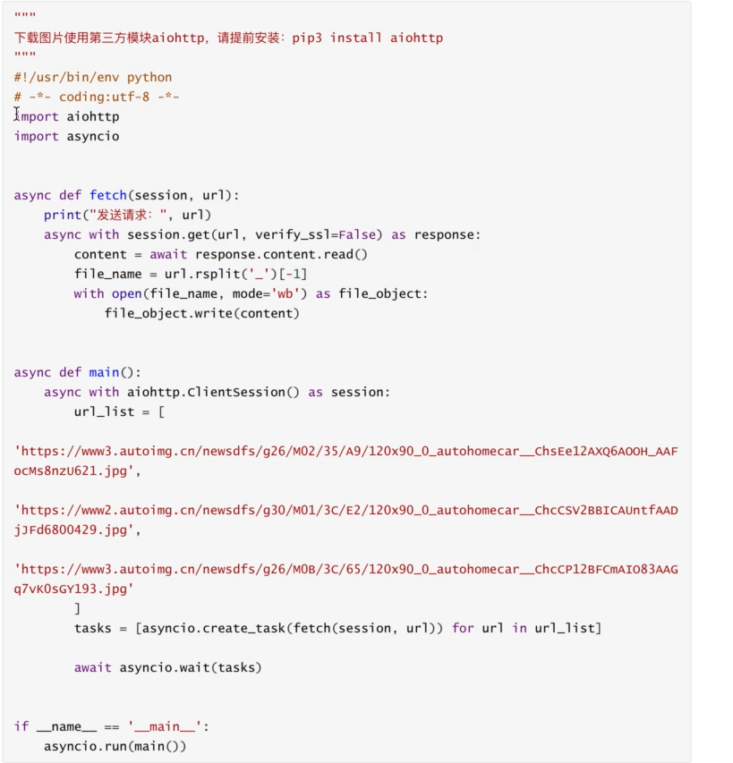

## 一、协程

通俗讲：用一个线程在代码之间来回切换游走的运行！！！

官方定义：协程Coroutine，也成为微线程，是一种用户态内上下文来回切换技术，简而言之就是通过一个线程实现代码块间来回切换运行。	

实现的主要集中方法：

+ greenlet，一种早期的库
+ yield关键字
+ asyncio装饰器（py3.4）
+ async、awaite关键字（py3.5）==最主流== 

对于这四种方式我们分别进行介绍：

#### 1.1greenlet实现协程

> pip install greenlet

```python
from greenlet import greenlet

def fun1():
    print(1)
    gr2.switch() # 切换到fun2函数
    print(3)
    gr2.switch( )
    
def fun2():
    print(2)
    gr1.switch()
    print(4)
    
    
gr1 = greenlet(fun1) # 绑定函数
gr2 = greenlet(fun2)


gr1.switch() # 转到fun1函数进行执行
```

#### 1.2 yield关键字

```python
def fun1():
    yield 1
    yield from fun2
    yield 2

def fun2():
    yield 3
    yield 4
    
f1 = fun1()
for item in f1:
    print(item)
```

#### 1.3 asyncio

> python 3.4 之后才有

```python
import asyncio

#asyncio,coroutine
def fun1():
    print(1)
    yield from asyncio.sheep(2)
    print(2)
    
def fun2():
    print(3)
    yield from asyncio.sleep(2)
    print(4)

tasks = [
    asyncio.ensure_future(fun1),
    asyncio.ensure_future(fun2)
]

loop = asyncio.get_eevent_loop()
loop.run_until_complete(asynic.wait(tasks))
    
 
```

 ==牛逼在遇到IO自动在tasks中切换任务==

当我们将yield from sleep改成一个网络请求的时候，我们就可以发现他的厉害之处了

##### 1.3.1 yield from的使用：

首先了解一下python 生成器（generator）：==一种返回值的迭代器== 

包含两种表示：

+ 生成器表达式
+ 生成器函数

四种生成器：

+ 通用生成器
+ 协程生成器
+ 委托生成器
+ 子生成器

###### 生成器表达式：

生成器表达式是用圆括号来创建生成器，其语法与推导式相同，只是将 [] 换成了 () 。 生成器表达式会产生一个新的生成器对象。

```python
In [1]: type([i for i in range(5)])
Out[1]: list

In [2]: type((i for i in range(5)))
Out[2]: generator
```

又称之为隐式生成器。他禁止使用yield、yield from表达式

实例:

```pytho
In [1]: a = (i for i in range(5))

In [2]: next(a)
Out[2]: 0

In [3]: next(a)
Out[3]: 1

In [4]: next(a)
Out[4]: 2

In [5]: next(a)
Out[5]: 3

In [6]: next(a)
Out[6]: 4

In [7]: next(a)
---------------------------------------------------------------------------
StopIteration                             Traceback (most recent call last)
<ipython-input-7-15841f3f11d4> in <module>
----> 1 next(a)

StopIteration:

```

和迭代器是不是很像：（回顾一下迭代器的例子），一个对象要可以使用迭代器，就必须得实现  iter 和 next魔法方法！！！

```python
class MyIterator:
    def __init__(self,data:int):
        self.data = data
        self.length = len(data)
        self.index = -1
    
    def __iter__(self):
        return self
   	
    def __next__(self):
        self.index += 1
        if self.index == self.length:
            raise StopIterator
        else:
            return self.m[self.index]
            
        
```

######  重点：生成器函数

==若函数中使用了yield关键字，则返回值是一个生成器== （generator）

此时函数中的代码并不会真的执行，而是只有 显示或隐式的调用 next()函数的时候才会执行，儿yield关键字会暂时停止函数的执行，并返回中间结果！！！(会保存函数执行的上下文！！！)

实例：

```python
In [1]: def fun():
   ...:     for i in range(5):
   ...:         print("Start...")
   ...:         yield i
   ...:

In [2]: fun
Out[2]: <function __main__.fun()>

In [3]: fun()
Out[3]: <generator object fun at 0x04F5D140>


```

了解执行逻辑：每次yield函数都会有一个返回值，并且将这个返回值作为生成器中的一个内容！！！并且，函数执行到 当前yield代码

```python
In [1]: def fun():
   ...:     for i in range(5):
   ...:         print("Start...")
   ...:         yield i
   ...:

In [2]: for i in fun():
   ...:     print(i)
   ...:
Start...
0
Start...
1
Start...
2
Start...
3
Start...
4

```

```python
>>> def fun():
	print(1.1)
	yield 2.1
	print(1.2)
	yield(2.2)
	print(1.3)

>>> for i in fun():
	print(i)

	
1.1
2.1
1.2
2.2
1.3
>>> for i in fun():
	print("=======")
	print(i)

	
1.1
=======
2.1
1.2
=======
2.2
1.3
```

也就是说，调用for i的时候，for 关键字会调用next函数，而next函数就是执行直到遇到yield关键字或者return返回！！！	

当然外部可以使用send方法向生成器函数yield的地方传入值！！

语法为：

>  receive = yield value

receive 将收到 send 方法中的参数的值。

注意：在启动生成器函数时只能 send(None) 或使用其他方法（next() 、__next__()），如果试图输入其它的值都会得到错误提示信息。

第一次执行之外的每次执行，首先是在上一次停止的 yield 之处把传入值赋给 yield 语句左侧的变量（如果有的话），当然，没有传入任何值的 receive 将赋予 None ，然后执行到下一个 yield 语句并返回其右侧表达式（如果有的话）的值。

```python
In [1]: def fun():
   ...:     for i in range(5):
   ...:         print("Start...")
   ...:         receive =  yield i
   ...:         print(receive)
   ...:

In [2]: f = fun()

In [3]: next(f)
Start...
Out[3]: 0

In [4]: next(f)
None
Start...
Out[4]: 1

In [5]: next(f)
None
Start...
Out[5]: 2

In [6]: f.send("hello")
hello
Start...
Out[6]: 3

```

```python
>>> def gen():
	    print('line 1')

	    yield 1
	    print('line 2')
	    yield 2
	    print('line 3')
	    yield 3
	    print('line 4')

	    
>>> g = gen()
>>> print(next(g))
line 1
1
>>> print(next(g))
line 2
2
>>> print(next(g))
line 3
3
>>> print(next(g))
line 4
Traceback (most recent call last):
  File "<pyshell#33>", line 1, in <module>
    print(next(g))
StopIteration
```


通俗的说含有 `yield from` 关键字的函数是委托生成器， `yield from` 后的函数是子生成器 

>  yield from iterable 是 for item in iterable: yield item 形式的语法糖 

```python
>>> def conter(n):
	for i in range(n):
		yield i

		
>>> def inc(n):
	yield from conter(n)

	
>>> fool = inc(10)
>>> next(fool)
0
>>> next(fool)
1
>>> next(fool)
2
>>> 
```


#### 1.4 async & awite关键字

> py3.5之后才可以使用

主要就是为了使asyncio在使用上更加方便

+ 不再使用装饰器，转而使用async关键字
+ 将yield from转为awite

举例：


==只有await关键字，后面紧接着 可等待对象才可以导致 协程的切换！！！===

```python
import asyncio

#asyncio,coroutine
async def fun1():
    print(1)
    awite asyncio.sheep(2)
    print(2)
    
async def fun2():
    print(3)
    awite asyncio.sleep(2)
    print(4)

tasks = [
    asyncio.ensure_future(fun1),
    asyncio.ensure_future(fun2)
]

loop = asyncio.get_eevent_loop()
loop.run_until_complete(asynic.wait(tasks))
```

#### 协程的意义是什么:

+ 在一个线程中，如果遇到IO等待的时间，线程不会傻傻的等待，而是利用干其他事情去（==就是非常智能的异步== ）==充分利用线程== 

案例：下载三张图片（含有网络IO）

+ 普通方式

```python
import requests

def download_image(url):
    print("begin download...")
    response = requests.get(url)
    print("download finished!!!")
    
    # save the data
    file_nane = url.split('/')[-1]
    with open(file_name, mode = 'wb') as f:
        f.obj.write(response.content)
        
if __name__ == '__main__':
    url_list = [
        'xxx',
        'xxx',
        'xxx'
    ]
    for item in url_list:
        down_load(item)
    
    
```

+ 使用异步函数方式

> pip install aiohttp

```python

```



## 二、具体代码（异步编程）

#### 3.1循环事件

理解成一个死循环，不断检测列表里的任务，并执行某些就绪的任务


执行IO请求：不可执行！

执行IO请求完成：变为可执行！

```python
import asyncio

# 去生成一个事件循环
loop = asyncio.get_event_loop()

# 将任务放到·任务列表中·，让事件循环不断检测任务是否可执行
loop.run_until_complete(任务_List)

```


#### 3.2 快速上手

协程函数：在定义函数时采用： `async def 关键字`

协程对象：执行协程函数`协程函数()`

> 注意：创建协程对象时，其内部代码不会执行（和函数内部使用了yield关键字的效果一样）

那如何将 函数运行呢？

将协程对象 和 事件循环搭配使用！！！

```python
import asyncio

async def fun():
    print(1)
    sleep(1)
    print(1)

#loop = asyncio.get_event_loop()
#loop.run_until_complete([
    fun(),fun(),fun()
#])

asyncio.run(
	[fun(),fun(),fun()] # py3.7
)


```

最后两行可以有更简单的写法

> 直接用：asyncio.run(
>
> [fun(), fun(), fun()]
>
> )代替！！！python3.7之后

####  3.3 await

异步等待！！！

==只有await关键字，后面紧接着 可等待对象才可以导致 协程的切换！！！=== 

以后后面加可等待对象:

+  ==**协程对象**== (上面提到过，就是async def 定义的协程函数的实现)
+ Future
+ Task对象

```python
import asyncio

async def fun():
    print('begin....')
    response = await asyncio.sleep(2)# 得到等待对象的返回值
    print("finished")
    
asyncio.run(fun())
    
```


run函数里面加入一个或者一些协程对象！！！

实例3：

awite 函数，必须等到后面 紧跟着的 可等待对象有返回值后，才能继续往下执行。

因此 output:   start end 返回值  start end 返回值

#### 3.4 task对象

是帮助你在事件循环中，添加多个任务！！！

创建:

> asyncio.create_task()

```python
 import asyncio
async def fun():
    print(1)
    await asyncio.sleep(2)
    print(2)
    return "return value"

async def main():
    print("main beginning")
    
	# 创建task对象，并将func添加到事件循环！！！，
    task1 = asyncio.create_task(fun())
    
    task2 = asyncio.create_task(fun())
    
	# 此时时间循环里面有三个，可能待对象：两个fun taski对象，一个 协程对象！！！
    await asyncio.sleep(3)
    print("main finished")
    
	# awite 依然o有那个特性：必须等待后面的可等待对象返回值后才能继续往下执行
    ret1 = await task1
    ret2 = await task2
    print(ret1,ret2)
    
asyncio.run(main())


output:
main begging
1
1
2
2
main finished
return value return value
```

实例2：(更加常用的)

```python
import asyncio
async def fun():
    print(1)
    await asyncio.sleep(2)
    print(2)
    return "return value"

async def main():
    print("main beginning")
	# 创建task对象，并将func添加到事件循环！！！
    task_list = [ 
        asyncio.create_task(fun(),name='n1'),
    	asyncio.create_task(fun(),name='n2')
	]
	# 此时时间循环里面有三个，可能待对象：两个fun taski对象，一个 协程对象！！！
    await asyncio.sleep(3)
    print("main finished")
    
	# awite 依然o有那个特性：必须等待后面的可等待对象返回值后才能继续往下执行
    done, pending = await asyncio.wait(task_list,timeout=None)
    for i in done:
        print(i)
    print(pending)
    
asyncio.run(main())

output:
main beginning
1
1
2
2
main finished
<Task finished name='Task-3' coro=<fun() done, defined at /home/tom/code/pythonCode/AsyncioStudy/task对象.py:2> result='return value'>
<Task finished name='Task-2' coro=<fun() done, defined at /home/tom/code/pythonCode/AsyncioStudy/task对象.py:2> result='return value'>
set()
```

实际上 done就是一个任务的返回对象，里面记录了各种信息！！！

而pending 一般很少用到，因为它是存放着一些未 执行完毕的函数（asyncio.wait设置了timeout参数）


实例3：

在调用 asyncio。create_task方法时，一定要保证已经创建了时间循环！！！！，否则会报错，或者我们使用另外一种结构！！！

```python
import asyncio
async def fun():
    print(1)
    await asyncio.sleep(2)
    print(2)
    return "return value"


# 仅仅存放携程x对象！！！
task_list = [
    fun(),
    fun()
]

# 在asyncio.run之后加入！！！
asyncio.run(asyncio.wait(task_list))

# asyncio.wait 会自动调用 asyncio.create_task函数！！！
```


总结：就是帮助我们立即向时间循中 添加  task对象！！！


#### 3.5 asyncio.future 对象

更低级的接口，更加的底层，是task类的基类！！！task 对象的 await结果的处理，就是基于future对象来的。future维护了一个状态值，用于告诉时间循环，此时这个可等待对象的状态！！！！


以后写代码 当使用 线程池（进程池）与 协程交叉使用时，我们就需要注意，虽然大部分都不会交叉：

#### 3.6 基于线程（进行）实现异步编程


（当遇到你主要使用的是异步编程，但是遇到某个第三方库不支持异步，我们就可以使用这个方法！！！）

案例！！：

==一个最常使用的例子== ：爬虫中的 request库是不支持 异步的！！！所有必要使用这个方法！！！


#### 3.8 异步上下文管理器


#### 3.9 uvloop

是python自带时间循环的 第三方 替代方案， 据说效率 比 python自带的 时间循环 效率更高！！！

> pip install uvloop

```python
import asyncio
import uvloop
# 这相当与一个替代函数
asyncio.set_event_loop_policy(uvloop.EventLoopPolicy())

# 代码编写和以往一模一样

# 在执行 asyncio.run() 方法时，会默认替换使用uvloop中的方法

# 其实对我们的编程没有太大影响，只需要添加 asyncio.set_event_loop_policy(uvloop.EventLoopPolicy()) 就行。
 
```


## 三、具体案例


#### 3.1 爬虫

正确的使用应该是 使用支持 异步的  http请求库， 或者 使用多线程来模拟 异步协程（不推荐），所以我们要首先安装

> pip install aiohttp

```python
# 需要使用异步爬虫，因此就需要提前下载一个89 支持异步请求的的库

# pip install aiohttp
import aiohttp
import asyncio

async def fetch(session, url):
	print("begain download")
	async with session.get(url, verify_ssl=False) as response:
		text = await response.text()
		print(f"result is getted:{text}")


async def main():
	async with aiohttp.ClientSession() as session:
		url_list = [
			'https://www.bilibili.com',
			'https://www.baidu.com',
			'https://www.bing.com',
		]
		task_list = [
			asyncio.create_task(fetch(session,i)) for i in url_list
		]

		await asyncio.wait(task_list)


asyncio.run(main())
```


如果使用传统的requests库，由于其不支持 async异步，因此 我们写以下的代码：

```python
import asyncio
import requests
async def fetch(url):
	print("begain download")
	res = requests.get(url)
	print(f"result is getted:{res.text}")


async def main():
	
	url_list = [
		'https://www.bilibili.com',
		'https://www.baidu.com',
		'https://www.bing.com',
	]
	task_list = [
		asyncio.create_task(fetch(i)) for i in url_list
	]

	await asyncio.wait(task_list)


asyncio.run(main())
```


！！这是不正确的

#### 3.2 异步操作mysql


> pip install aiomysql	


注意：我现在正在做的中央监管机构，就必须使用 一步操作mysql！！！！！！！！


> 如果遥操作的第三方库，没有支持 异步IO，其实我们也讲了解决方法，就是在3.6中！！！

#### 3.3 fastAP框架(和falsk非常相似)

但是falsk默认不支持异步IO，但是falsk中可以支持多线程，来实现异步IO，即可以支持很多个人同时访问！！！

> pip install fastAPI
>
> pip install uvicorn ( asgi内部基于unloop)

实例：


