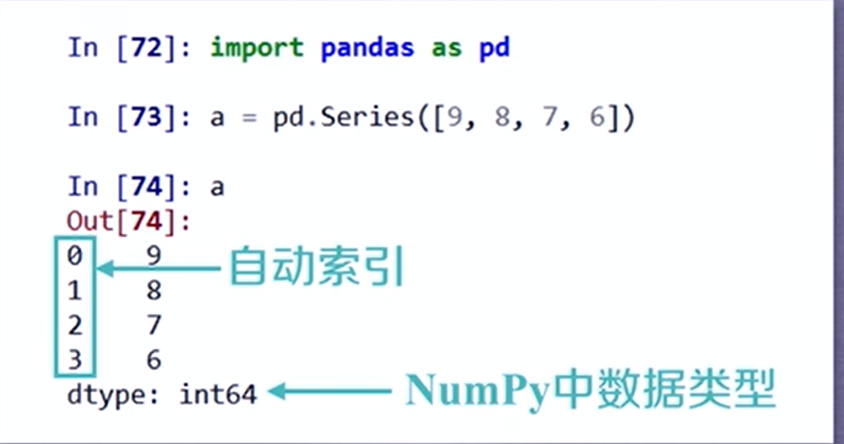
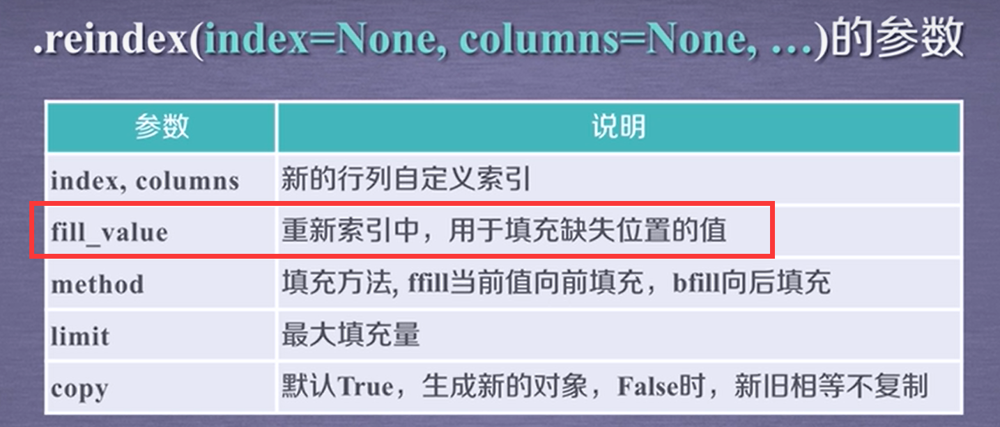

# 数据分析

## 一.numpy基础

### 1.1 创建ndarray对象

我们之前可能使用一个列表保存一组数据，现在可以使用numpy了

使用**np.ndarray类的对象**表示n维数组,使用**np.array()创建**，传入数组


```python
import numpy as np
#第一种创建方式
a = np.array([1,2,3,4,5])
#第二种创建方式
a = np.arange(起始值，终止值，步长) 左开右闭！！！
a = np.arange(0,5,2)
#[0 2 4]
#类似于第二种
第三个参数代表要去多少个点，在设置函数的x值又有大用处
a = np.linspace(1,3,100) 左闭区间右闭区间！！！
默认元素为float类型
#第三种方式
a = np.zeros(数组元素个数/shape ，dtype='')
#第四种
a = np.linspace(起始值，终止值，要生成的点个数) 左闭右闭！！
```


==注意，以上所有生成的方法，都可以指定dtype参数指定元素类型== 

```
5个1/5：
np.ones(5)/5
```


创建一个维度和d的全0数组，同时依然可以使用dtype来指定数组的类型

```python
import nunpy as np
#创建array对象
arr = np.array([1,2,3,4,5,6])
print(type(arr))
#[1 2 3 4 5 6] 输出结果和我们之前用列表表示的一摸一样

#返回维度,返回一个元组，（行，列）
arr.shape
#(6,)代表有一行，并且一样有6个元素，（省略了行，只有列
#强制换为2行3列，但是前提是数据得正好够
arr.shape = (2,3)
print(arr)
#[
#[1 2 3][4 5 6]
#]
arr.shape = (6，)
#数组的运算
#直接相当于对于数组的每个元素进行运算（和向量一样！！！）
print(arr,arr*3)
#[1 2 3 4 5 6] [3 6 9 12 15 18]
print(arr>3)
#[false false false True True True]
print(arr+arr)
#[2 4 6 8 10] 对应位置上的元素做运算，要求两个数组的维度必须相同！！！
```

### 1.2内存中的ndarray对象：

（arr = np.array([1,2,3,4,5]）)

在内存中分为两块：**元数据和实际数据**


好处：**变维度方便的很，直接改变shape就行，而不用改变实际数据** 

​		**dtype规定**了数组的每个位置 的数据类型,一个数组只对应一个dtype，定死了！！！ 定死了好处：**更加利于寻址**，这一点和c语言很类似

**data**就是一个指针，指向实际数据的保存位置

### 1.3 ndarray对象的具体操作：

#### 1.3.1获取数组元素的个数


实际上就是维度的所有数相乘

#### 1.3.2获取数组的维度，返回元组


#### 1.3.3 修改shape参数

注意：

==zeros（5，1）与zeros（5）返回的手机两种不同的东西，一个是二维的，一个是一维的== 


### 1.4 dtype 属性

detype属性就是允许数组每个位置可以装什么元素

#### 1.4.1改变数组的dtype属性


ary.astype不会改变原来数组，而是会生成一个新的数组

对于数组的元素类型我们只要掌握，使用的**dtype**但是来指定 类型，以及对数组做类型转换，即**astype方法**即可，**切勿直接改变dtype**，**得使用astype方法**

如何快速判断一个数组是几维度的：直接数从开头有几个连续的【

三维数组的访问：和c语言一摸一样！！！！


当然我们可以使用三层for循环来遍历！！！！！！


#### 1.4.2 dtype种类以及相应的表示符


由于numpy生来就是处理数字的，所以不允许存自定义对象，他就是用来做高速运算的。。。。 


#### 1.4.3 dtype种类的简写


简写更加方便

==字符== U30 代表允许最大放置30个字符的字符串

### 1.5 np对象的维度操作

#### 1.5.1 改变ndarray对象的维度


 

以上两个的区别：第一种相当于原数组的一个映射，相当于之心创建了一个元数据空间，实际数据空间和之前共享，第二种为生成一个新的数组，同时新开辟一个元数据空间和实际数据空间


而我们最开始是用的是直接改变shape，arr.shape = (2,3)，这种是直接改变！！！称为就地变维！！ ==**arr.resize(2,3)**==  ==这是最常使用的== 


### 1.6数组切片操作！

#### 1.6.1一维数组的切片


同样是从0开始数，**左开右闭**,和**python中的列表一摸一样**

#### 1.6.2 二维数组的切片：

==先给逗号分隔，在各自维度使用一维度的切片法即可== 


表示切出一三两行


一三行、一三列 的交集

### 1.7 dytype的掩码操作

#### 1.7.1 布尔值掩码


100内三的倍数

```python
arr = np.arange(1,100)
arr = arr[arr%3==0]
```

#### 1.7.2 基于索引的掩码


基于索引的掩码、基于布尔值的掩码

### 1.8 多维数组的组合与拆分

#### 1.8.1 垂直方向上的操作

==np.vstake(arr1,arr1)== 

==arr1,arr2 = np.vsplit(arr,count)== #表示从垂直方向上均匀拆分成count分


#### 1.8.2水平方向的操作

==np.hstack(arr1,arr2)== 

==arr1,arr2 = np.hsplit(arr,count)== 


#### 1.8.3深度方向 操作

：可以拓展数组的维数


深度方向组合与切分了解即可


#### 1.8.4（数组补齐）长度不同的数组组合

pad(array, pad_width, mode, **kwargs)

返回值：数组

> array——表示需要填充的数组；
>
> pad_width——表示每个轴（axis）边缘需要填充的数值数目。
> 参数输入方式为：（(before_1, after_1), … (before_N, after_N)），其中(before_1, after_1)表示第1轴两边缘分别填充before_1个和after_1个数值。取值为：{sequence, array_like, int}
>
> mode——表示填充的方式（取值：str字符串或用户提供的函数）,总共有11种填充模式


返回一个新数组，pad_width=(0,1) 意思是在开头补0个，在末尾补一个

#### 1.8.5简单一维数组的组合（了解）


==两个一维数据转化为两行或者两列==

row_stack   colum_stack()

### 1.9 ndarray的其他常用属性


这些了解即可

#### 1.9.1 flat扁平迭代器

flat扁平迭代器，相当于把一个高维数组给给拉平了，方便我们迭代

`for i in arr.falt`


#### 1.9.2 ==转置==  ==arr.T==

注意：三维：页、行、列  二维：行、列

   返回转置后的视图

### 1.10 读入excel数据并转为矩阵（mat方法）：

```python
import numpy as np
import xlrd
def excel_to_Matrix(path):
#读excel数据转为矩阵函数
    data = xlrd.open_workbook(path)
    table = data.sheets()[0]
    #获取excel中第一个sheet表
    nrows = table.nrows
    #行数
    ncols = table.ncols
    #列数
    datamatrix = np.zeros((nrows, ncols))
    for x in range(ncols):
        cols = table.col_values(x)
        cols1 = np.matrix(cols)
        #把list转换为矩阵进行矩阵操作
        datamatrix[:, x] = cols1
        #把数据进行存储
    return datamatrix
print(np.mat(excel_to_Matrix("评分表.xlsx")))
```

原始数据图：


## 二. matplatlib绘图

### ==常用颜色==

### ==所有标记点的形状== 

所有的点形状：


### 1.matplotlib的基本概述

#### 1.1基本图形元素


#### 1.2基本图像的分类


#### 1.3经典案例


==show是一个阻塞方法== ，千万别在 代码中间调用show方法

### 1.2绘制水平与垂直直线


允许某个参数以数组的形式传入，同时画多条直线


### 2.plot函数

#### 2.1举例

正弦曲线：


==np.linspace== 的作用是在一个范围内线性拆分取点

#### 2.2 设置线性、线宽、线的颜色

设置的参数为： linestyle、linewidth、color 、


**线型只有四个**   -  --  -.  ： 只考虑这四个，分别为，**横线、虚线、点横线、点线**

颜**色：可以传入rgb元组**，也可以直接指定英文颜色名，如果rgb为四个，则第四个为 透明度！！！

### 3.设置坐标轴范围与坐标轴label

设置坐标轴文本：

```python
mp.xlabel(str,fontsize='')
mp.ylable(str,fontsize='')
```

、


### 4设置坐标轴刻度及刻度文字大小


当然有些符号无法使用输入法打出来，所以==matplotlib可以支持 latex==

效果如下：==latex字符串之前必须加一个原始字符串标记== 


### 5设置坐标轴的位置（默认两个坐标轴都是在左下角）


#### 5.1举例，将坐标轴放到图像正中央


### 6 设置图例

==本质就是把之前设置的label用图例显示出来== 

==调用legend之前得设置标签，标签可以使用latex写==  


### 7.scatter函数画点


另外，==边缘色以及填充色可以统一使用 color 参数设置==


### 8.给某条曲线添加备注


### 9.画布figure

#### 9.1创建一个figure

一般只设置 窗口标题栏 以及 图标的背景颜色 facecolor


**综上可以看出，调用一次 show方法，可以 一次 显示出所有的画布figure**

**所以show函数还是需要最后使用**

#### 9.2多画布之间的切换

你画的图所在的窗口取决于你写代码的位置，你所画的东西将会显示在==最近一次创建的窗口当中== ， 但如果你想要再画之前的窗口，那么你就要重新调用一次 figure方法，并且要求 窗口标题 和之前的一样就行！！！，这样系统就不会认为你是在创建新窗口，而实将旧窗口 置为当前窗口


#### 9.3设置出窗口的相关参数


mp.tight_layout()方法就是当显示的时候出现一些问题的时候会调用

#### 9.4设置图标标题

mp.title(str,fontsize='')

### 10设置图标背景网格线


### 11.子图

总共有三种子图布局方式

#### 11.1三种子图布局模式（主要看矩阵式布局）


案例：

绘制3x3图，每个图中写一个数字：


### 12.在图中写一个文本


这是一个==在图中写 文本的函数== ，前两个参数表示 位置（坐标轴位置），第三个表示 文本，第四个第五个表示显示的居中格式，其他的自己看


（用的时候过来看一下就行）


### 13.散点图：


产生符合均匀分布的 一些列值：


（均值，震荡幅度，数量）

举例：


想实现距离平均值越远，颜色越浅：


cmap是一个映射，有很多的映射如下：（需要用是去查一下就行）


cmap = 'jet_r'代表反转，数越大越偏蓝，越小越偏红

### 填充


用于两条曲线之间填充颜色：

举例：

并填充两条线之间的区域：


添加这行代码可以：


可以再两条曲线之间涂色


### 14条形图（柱状图）：


width 通常在0到1之间 （太大 柱状图之间重叠，需要自己测试）


三个柱子的展示问题


设置柱子的横坐标：


### 15饼状图

​	

案例：绘制五种编程语言的流行程度：


默认是显示的一个 扁的圆，而mp.axis()的作用就是让显示为一个圆！

### 16等高线图

==图像怎么画不重要，重要是怎么把数据整理出来== 


一个二维的图，显示一个三维的图型，每一个点记录三个值（精度，维度，高度）


inlinespacing 指的是 数据与等高线的距离

xyz 后面的b指的是 分8份的意思，==可以控制等高线的密度==

8后面==设定cmap的作用可以让颜色渐变==，

 


### meshgrid（）：

作用：生成**网格点坐标矩阵**，返回x坐标、y坐标的二维矩阵 ，==依然是认为最左上方为原定==，认为下面是y的正半轴

 

两组配套形成一组xy坐标

### 17热成像图

用图形的方式，显示矩阵及矩阵中值的大小

把矩阵Z图形化使用cmap来表示矩阵中每个值的大小


案例：


### 18 .3D图形绘制


#### 18.1三位点阵


案例，绘制三位点阵：


mp.show()

xyz分别是一维 数组，s是设置 点的大小，marker设置点的形状，c是设置后面cmap是根据 d的值大小来进行颜色的设置，所以d也是一个一维数组，每个数值对应着一种颜色，cmap是设置 colorbar的种类（在本例中表示==越靠近原点越红==）

效果：


设置坐标轴名称：

#### 18.2三维曲面


==行跨距、列跨距 就是代表合并多少个小方格来涂色== 


三维框图（不如）


像个渔网

### 19.图像保存：


## 三.numpy进阶

### 1.numpy文件读取


常用的为==csv文件== ，==excel文件也可以转换为 csv文件== ，excel支持csv文件的转换

读取方法：


举例：


保存方法：


举例：


局限性：以上两种方法只能使用在一维、二维数据的存储与读取

下面介绍任意维数据的存储与写入：

文件写入：


可以看到，文件中没有任何关于数据的未读信息，只是单纯的把所有数据拿出来写入

==另外，当我们不指定 sep的时候默认是以二进制写入== 不要认为二进制写入不好，二进制一般可以更加节约空间！！！

文件读取：


举例：


### 

numpy提供的更加便捷的方法：


但是用这种方法，就只能使用 numpy识别


如果只涉及 这一个库，那么np.save 与 np.load 无疑是最好用方法！！

### 2.进阶的一些函数

#### 2.1符号函数


就是将一个数组转化为只有0、-1、1三个数字的相应数组

#### 2.2数组处理函数

（比符号函数更加智能）


举例：


### 3.函数矢量化：

function_vec = np.vectorize(function)


本质上就是让 本来只能处理 单变量的函数，矢量化之后能够处理 数组，并返回数组。

原来我如果想对100个数据使用fun函数，需要i调用100次，但现在只需要形成数组，一次性传入就行了

举例：


 时髦一点就这样写：


参数的各个维度必须相同

==特殊情况：== （但是如果一个维度为一另一个不唯一，矢量函数也能计算，本质上和就是一对多的关系）

### 4.矩阵

#### 4.1矩阵和多维数组的区别


==继承numpy.ndarray==

copy = True表示有两份数据，copy = false 相当于我们之前的视图模式


举例：


   

==实际中能用第二种就用第二种==  节省空间


#### 4.2矩阵乘法 与 多维数组乘法的区别


==我们之前说过 即使 一个ndarray类（即多维数组）长得像 一个矩阵，它们之间相乘也是对应位置的乘法，而 matrix严格遵守矩阵乘法,要与ndarray的乘法区分规则== 数组乘法要求 维度完全一样，而 矩阵乘法要求第一个的列数等于第二个的行数

#### 4.3 矩阵求逆

matrix.I   注意对为数组那边能求转置，方法式array.T


==m.I 得到矩阵的逆== 

可以把逆矩阵的定义推广到非方阵，称为广义逆矩阵

### 5.通用函数


也可利用掩码来做 == a[a>5]


### 6.numpy的随机数函数子库


注意：d0、d1……dn这些参数是指定 数组的维度！！！


设置种子的意义：


更加高级一点的随机函数：


举例：


In【61】：设置p= ？？的意义：意思是值越大，被抽取的概率越大！！！（不写p则默认为等概率抽取）

均匀分布、随机分布、泊松分布：


### 7统计函数：


不指定axis默认是对每一个数据进行计算，给定axis（=0，1，2，3，4）表示按照第i维度进行计算。axis=1表示，按照第二维度计算，第一维度任然保持之前的样子。

分别能计算：==均值、和、加权值、标准差、方差== 

举例：


其余的统计函数：


举例：


==重塑多为下标== ！！！！

梯度函数：


举例：


多维数据的梯度函数：


### 8.图像的数组表示


使用 PIL库处理图像：


==使用numpy数组表示图形：==  


图像变换：


### array.all 、与 any方法

####  矩阵加法与乘法函数


外和与外积使用如下:


#### 除法（对矩阵的每个元素操作）：


np.divide(a,b) 与a/b的效果了一摸一样，每个位置对应一个float类型

==trunc（a/b）结果可能与a//b的结果是一模一样的== 


### 位运算通用函数


比如说 使用异或^就很方便的判断出两个数是否异号

#### **异或**


np.where 函数用来 返回满足某个条件的数值的下标

#### **与**


#### 三角函数

np.sin   np.cos  np.tan  np.pi

```python
import numpy as np
arr1 = np.linspace(0.np.pi,1000)
y = np.sin(2*np.pi*arr1)

import matplotlib as mp 
mp.figure('sin',facecolor = 'lightgrey')
mp.plot(arr1,y,**********省略了一系列参数)
mp.legend()
mp.show()
```

##  三.pandas库介绍


pandas的两大优点：

+ 提供了高效的数据类型
+ 提供了高效的数据分析方法


pandas特别强调数据与索引的关系

Series类型：


举例：

自动索引：




设置索引：


Series类型的创建：


 


Series类型的操作：


和字典类型非常像！！

举例：


==Series = Index + ndarray== 

==自定义索引与自动索引并存== 


与Ndattay的关系：


与字典的关系：


in 本来是判断 键是否在字典中


get 函数的第二个参数：表示如果不含f，则返回 100

Series运算：

==索引值相同的运算，不同的没法运算== 


index、series对象的name属性：


dataframe类型：


索引+多列数据 构成！！！


==行索引称为 index，列索引称为 column== 


dataframe 的创建：


可以看到确实是通过字典来创建的

（在字典中的值中设置 index，字典中的键设置 colum）


当然也可以不在 字典中设置 idnex，也可以在创建 dataframe时设置index参数

实战：


进一步理解：


对panda对象的操作：


重新索引：




实站：

新增加一列，并用200填充


dataframe的索引类型：


索引对象的常用方法：


==默认第一列（除index）的loc为0==


pandas对一组数据的使用提升到 对 index的操作，所以肯定是要比 numpy更加方便的 


算数运算法则：


 

使用方法的好处：可以选择一些可选参数，比如可以设置： fillvalue


如果希望运算发生在0轴上：（只能使用方法）

				