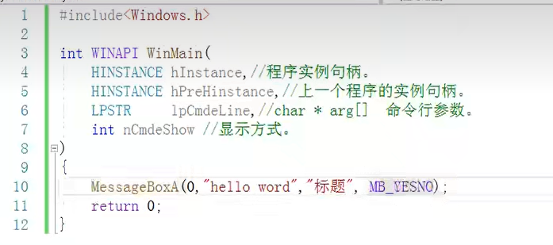

# 第一天

## 8个常用寄存器

32位：eax ecx edx ebx esp ebp esi edi 

16位：ax cx dx bx sp bp si di

8位：ah al ch cl dh dl bh bl


这些寄存器是有联系的：

+ 16位的是32位的低位
+ 8位是把16位的前四的拆成的高低位
+ 本质上只有8个常用的寄存器


虽然微软给我们规定了那些寄存器应当存一些什么数，但是好比我们去商店买了瓶子，但是里面装什么水是由我们自己决定的！

 ==右边是低位，左边是高位==

## 地址的表示

地址一共有三种： 

8位：byte

16位：word

32位：dword

（64位：qword）

在指令中如果要用到地址，地址得使用中括号，前面指明段寄存器再之前指明位数以及ptr

## mv指令

mv 目的操作数 源操作数

注意两点：

+ 两者不能都是立即数

+ 两者可以是 立即数0x类型的，寄存器，地址

+ 两者不能都是地址

+ 两者的宽度一定要合适

+ ==mov指令默认的就是用零填充==

  

举例： mv eax dword ptr ds:[0x11111111]

​		mv al byte ptr ds:[0x11]

## add指令

add	目的操作数	源操作数

  ==目的操作数和源操作数相加的结果放入目的操作数中==


其他的指令也是两者操作之后放入目的操作数当中

==异或常用于数据加密==：对一个数字使用同一次异或两次得到的数据不变

自己与自己异或 可以用来==寄存器清零==

## OD的一些使用


首先我们得到了四个区域：

从左到右从上到下介绍：

第一块汇编代码区F12表示下一步，双击某一汇编代码可已经编辑汇编代码

在我们练习的时候，通常选中一大块区域右键使用noo填充，在自己写汇编指令进行填充

第二块区域：寄存器区域

第三块区域：数据区，在这里我么们可以使用CTRL + g 来打开搜索某一具体地址上的值，另外我们也可以再command区域输入指令：比如 `db 0x11111111` 第一个d表示搜索的意思，第二个b表示是以字节的形式表示出来，另外还有dw dd 两种表示形式，包含了堆栈区的数据。


右边每两个16进制为一组，视为一个字节！！！所以一行代表十六个字节

第四块区域：堆栈区域，在这里我们可以清晰的看到地址中存储的值

## 寻址方式


注释：表中的中括号前面少了dw ptr ds：[0x~~~~]

中括号里至多有两个寄存器！！

最后一种带比例的经常用于 ==数组==的使用

lea命令：

mv eax , dword ptr ds:[0x11111111]  将0x11111111地址上的值取出来给eax

lea eax , dword ptr ds:[0x11111111]  将0x11111111给eax，说白了就是仅仅把源操作数的地址给eax，仅仅计算地址，不取值

## 堆栈

堆栈=栈，是一种数据结构

但是`堆内存 栈内存`是两种不同的概念


栈的特点：

+ 先进后出
+ 地址编排 栈底的地址最大，向上递减
+ 栈的表示需要 `栈底（esp） 栈顶（ebp）两个寄存器的辅助` 
+ 读数据 可以 栈底减偏移 栈顶加偏移
+ push数据： `sub esp, 0x4 ;mv dword ptr [esp] ,0x12345678`
+ pop数据:`mv eax ,dword ptr [esp];add esp ,0x4`
+ get数据：可以利用栈顶或者栈底 

push 源操作数 （只有一个操作数，用于说明需要存放数据，简化了操作，当push一个立即数时无论立即数有多大，我们都会当4个字节处理，如果多余就去低4个字节数据，但是我们如果存入 寄存器或者指定大小的地址，系统就会智能的识别我们push的大小，`但最小只能push最16位的寄存器，也就是只让push16位与32位的数据`

pop 目的操作数 ，可以是寄存器或者地址，同样只能是16位或者32位的数据

pushad 与popad 后面不用接任何操作数，作用是：将 ==8个通用寄存器==依次入栈，与还原

## 标志寄存器Eflag


需要背诵，eflag高16位都没使用到（双击第二块区域的eflag值可以让相应位快速清零

注意

+ flag是受运算结果的影响，包括算数与逻辑运算
+ 类似mov、lea指令是不会改变eflag的

c标志位： 当运算数的 `最高有效位（我们常见的byte、dword、word）向前进位或者向前借位（不够减了）`，注意是最高配有效位，要考虑数据的宽度

o标志位：（针对于有符号数）首先我们检查有符号数的容器大小（byte，word、dword），最高位视为符号位，来看结果有没有溢出，最关键一点，当作有符号数

z标志位：结果为零

s标志位：结果转为二进制看最高位

暂时对我们重要的只有这四个标志位

## 段寄存器

（认实即可）

cs 代码段   

ds数据段  

ss堆栈段  

es、fs、gs这三个为辅助段寄存器

## 常用指令总结


inc指令不会影响cf，但是可能影响其他标志位


注意是imul！！！照片里写错了 ,imul则是扩展的后面接的操作数的数量，可以接一个、两个、三个数

div eax：eax除以ecx，商存放在eax，余数存放在edx中（宽度可以是8、16、32为）

mul：被乘数是根据数据的大小啊自动识别的


##### 移位运算指令


左移右移，移出的位放在cf中

##### 逻辑操作指令


cmp 的结果我么主要使用：cf 、sf

test eax，eax，和自己test主要用于判断某个寄存器是否为零，通过zf标志位来判断


## JCC指令（条件跳转指令）

首先回忆一下 eip寄存器：存放cup下一条将要执行的指令的地址，跳转指令就是会改变eip的值

jcc是一堆指令的集合，都是在满足某一条件后才会跳转

jcc指令后面只能接立即数！！！


jb指令看的是无符号数，看的事cf标志位！！！

jl指令看的是有符号数，看的是SF！=OF

## JMP指令

无条件跳转指令

与jcc指令的区别：

+ jmp后面可以接立即数、寄存器、内存地址
+ 但是jcc指令后面只能接立即数

## call指令

和jmp指令很类似：同样是无条件改变eip的值（注释：每当执行一个指令在第二哥个窗口中红色的代表在上一条指令被修改过的），我们得注意，我们此时不能再使用f8键了，要不然会相当于直接将整个函数执行完，我们有两个 选择

+ 使用f7单步 ==步入==
+ 使用ob下断点，直接在一个函数中的地址选中，按f2键，断点设置成功，此时按f8（ ==单步执行==）或者f9（让整个函数跑起来）

与jmp相比还会改变esp的值，

+ 首先会根据本条指令的长度（其实第一个窗口被分成了三个部分，中间哪个部分就是指令被翻译成的机器指令（可以使用ctrl+g去第三个窗口检验），之后将下==一条指令的地址push==，不同指令所占的字节大小是不同的）
+ 相当于先push（dword）再jmp

## retn指令

相当于pop eip，与call指令配合使用

实现函数的调用

## movs 指令


实际中我们常用三种：

movsb movsw movsd （使用的一定是==edi、esi==）

重点：执行movs之后，除了将【esi】的值赋给【edi】之外，同时还会改变edi、esi的值，会都加上容器大小（byte、word、dword）的字节，如果是byte，同时加1，word同时加2，dword同时加4

这个自加的动作联想到 堆栈 其实就是从上往下进行数据的读取了


## stos指令


执行完与movs类似，执行完之后edi也会加上相应的字节数


## rep重复操作前缀

重复操作前缀，后面跟一条指令，代表将后面那条指令重复执行n次，n的值由ecx寄存器  决定， 通常在后面会接 movs指令、stos指令。

！！！重复的次数取决于ecx，执行完一次ecs会自减1！！！,同时edi、dsi都会加上相应数字!


为了了解单次执行后的结果，我们得使用 F7 键！！！，当我们想进入一个函数的时候会使用也会使用f7

```java
mov ecx,0x3
movsd
 
```


## DF标志位(配合movs、stos使用)

控制movs 、 stos执行完之后edi 、esi 的地址加或者减

若df = 1：减

若df = 0 ：加（默认为加）


## 堆栈图

我们拉进一个程序，如果我们看到程序的初始地址不是以4开头（第一个非零的数字为4）的，db 选项-》调试设置-》 事件-》winmain，重启打开

若看见我们没见过的汇编指令：选中-》右键-》分析-》从模块中删除分析

第一个窗口的第四个模块相应的行双击可以写注释

```c++
#include<iostream>
int test(int a,int b,int c)
{
    int e = 0;
    int d = 2;
    e = a+1;
    d = c+1;
    return e;
}
int main()
{
    printf("begin\n");//用于方便定位main函数从哪里开始，只需窗口一右键ascill码或文本形式，就可以找到print begin的汇编代码地方
    int a= 0;
    a = test(1,2,3);
    printf("end\n");//方便定位main函数从哪里结束
}

```

注意托进db 的文件一定是：经过编译后的==exe文件==！！！

对于上面的c++程序的大致流程讲解：

+ 首先 push 0 //就是保存a的值
+ 保存参数按顺序保存3、2、1依次push
+ 调用 call 将下一条指令的位置push
+ ==将之前的ebp push==，并使ebp与esp持平！！
+ 由此我们进入了函数内部，并由函数自己为乎一段空间
+ 直接让esp提升一大段空给函数使用 sub esp 0x48
+ 将将要使用的寄存器依次push
+ 函数通过ebp+某个值调用传参的值，通过ebp-某个值调用函数内部的局部变量！！！
+ 最后恢复寄存器，并还原ebp、esp
+ 对于参数1、2、3所占用的看空间我们恢复


函数内部的图：


​	（上图EBX应该改成Edi因为最后push的是eid）


绝大多数的返回值会放到eax中，当然也可以放到其他寄存器甚至内存中！！！

## 函数调用约定

cdecall（默认）： ，就是平常我们写的函数，通过push传参，顺序从右向左push，外部平衡堆栈

sedcall：  与cdecall的区别就是使用ret + 立即数，功能就是内部平衡堆栈，参数也是通过push传


_fastcall：传参一部分使用寄存器传参，只有最左边两个参数会使用寄存器，其余还是会push（使用了edx、ecx）；使用方法类似就是将上面的WINAPI改成__fastcall


## 	如何找main函数

对于我们自己的函数，我们只需在第一行输出一个字符串，进去之后第一个窗口右键字符串查找即可！！！

但是对于未知的函数就很麻烦了。。。。

注意！！！在汇编中，main的外层其实还有很多层的壳，我们可以通过下面的方法一步一步网上找；换句话说main函数并不是第一个调用的函数！！！

通过找特征的方式找到main函数：1. ==ebp+4==对应的就正好是上一个函数的返回地址；2.实际上我们在进入函数后的push ebp指令处使用f2设置断点，此时由于上一步刚刚才call过，此时的esp就是调用前函数下一条指令的地址

alter+b：查看设置过的所有断点！！！alter+c返回窗口 

## if_else与switch的汇编

if-else与我之前再计算机组成原理学习的类似，就是判断if条件的反面，满足则跳转到else，否则执行if语句块

## moxzx、movsx指令 


两者都要求操作数二的宽度必须小于操作数1的宽度；

movzx 填充过后高位用0填充

movsx 填充过后高位用符号位（操作数2的最高位）填充


## for循环


编译后：

老师寻找main的方法优点离谱：

```bash
第一个jump进来
第一个call
第二个call
然后向下找到三个连续的call

```


```bash
选中第二个call
最后一个call
jump之后就找到main函数了！！！
```


## while循环


其他相同，就更换for循环：


还是比较简单易懂的

while比for 更简单干脆一点，上来就比较！！！

## do while


通过代码知道，do while上来就调用print，在执行减一操作，直接利用sub指令的结果来判断！！！

##  逆向练习

拿到一个exe文件首先第一件事就是先运行一下，了解大概是干嘛的，之后再拖进OD中；

在做crackme1.exe，其实没必要一定找到main函数，我们知道当输入不对时会有一个错误提示，我们就从错误提示入手，利用字符串查找

我们盲猜是由于我们输入的值与其之前的值不匹配导致的


也有可能选择搜索ASCLL

之后找到那一行，回车即可找到！！！


我们因此就找到的关键点！！！

之后往上翻就可以发现函数的入口点，作为新手的的话我们从这个入口点开始分析就ok了。


## window编程

window自带的数据类型


这些所谓的win自带的数据类型，其实都是基于C++的

句柄：


创建一个window窗口！！！：（MESSAGEBOX）



win32字符串处理（重点！！！）：


我们之前一直使用的都是char，在微软中就是CHAR，这与WCHAR的区别就是一个字符所占的空间不同，第三种代表位置的字符串类型，使用前需要先导入相应的的包。CHAR使用的是ascill编码，WCHAR使用的是unicode编码。WCHAR是以两个0结尾的。

由于有三种的字符串，因此对应的方法也有三种:


在window编程的函数一般分为A后缀和W后缀或者没有后缀的三种版本，而这三种版本对应着windows编程中的 A、W、T版本

==在不知道使用什么版本的时，在字符串前面一律加一个_T(str)== ，万精油x，但是要增加头文件==include<tchar.h>== 


DDL动态链接库


在物理内存中只有一份，只是在不同的应用进程中会有不同的映射，


### 


所以一般创建时需要传入安全描述符的都是内核对象，否则不是，那么什么是安全描述符呢：就是例如以下的结构体


每个进程都有一个句柄表，用来记录本进程打开的所有内核对象。

==句柄表理解为一个一维数组，句柄理解为这个一维数组的索引== 

既然在每个进程的句柄都不同，那么如何才能知道共享了一个内核对象呢？


每个32位的操作系统会给给每一个进程分配一个4g的虚拟内存空间，底两个g用户使用，高两个g内核使用。虚拟内存既要载入exe文件，也要载入dll文件。内核对象也放在高两个g。


可能打开一个，exe文件同时也要载入相应的dll文件

具体创建进程：


参数很多，但是大部分都属null

```c++
int main() {

	STARTUPINFOW sw{ 0 };
	PROCESS_INFORMATION pinfo{ 0 };

	CreateProcess(
		L"D:\\BaiduNetdiskDownload\\odbg110\\OLLYDBG.EXE",
		NULL,
		NULL,
		NULL,
		FALSE,
		0,
		NULL,
		NULL,
		&sw,
		&pinfo

	);

	CloseHandle(pinfo.hThread);
	CloseHandle(pinfo.hProcess);

		return 0;
}
```

进程相关操作：


文件相关操作：


线程：

我们可以理解为，进程是一个大容器，里面有代码和数据，而这些代码的执行需要依靠线程

程序加载进来时，就会产生一个主线程，一个进程可以包括很多的线程

线程的创建：

（内核对象都要传入一个叫安全属性的东西，这个我们填nULL使用默认即可）


SIZE_T天NULL，则是使用默认值1M

第三个我们要指明一个下面的一个东西：


下面一个就是要传入的参数

再下面一个参数：


最后一个参数：填NULL即可


实例如下：


注意：主线程的终止，会导致其他线程的终止（主线程就是我们理解的进程）

线程状态：


使用waitforsigleobject函数可以让主线程等待子线程的结束：


线程方法：


下面四个函数比较重要：

上面两个是获取 相应的句柄，下面两个是获取相应的 线程/进程ID


