激活函数：

需要线性可导

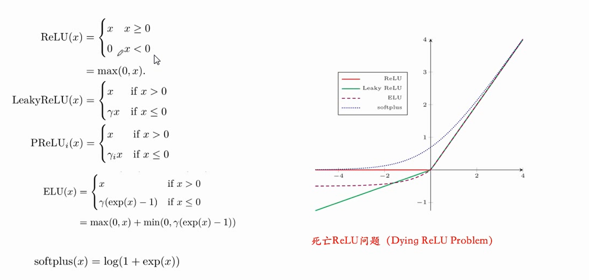

一般的机器学习 方法：

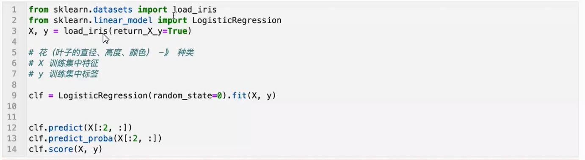

## pytorch基础

首先我们需要了解 tensors张量，他是 pytorch中的一种特殊的数据结构，他和numpy中的 ndarray十分类似，都是为了加快计算而衍生出来的数据结构，他的用法和ndarray十分类似。

基本用法见notebook

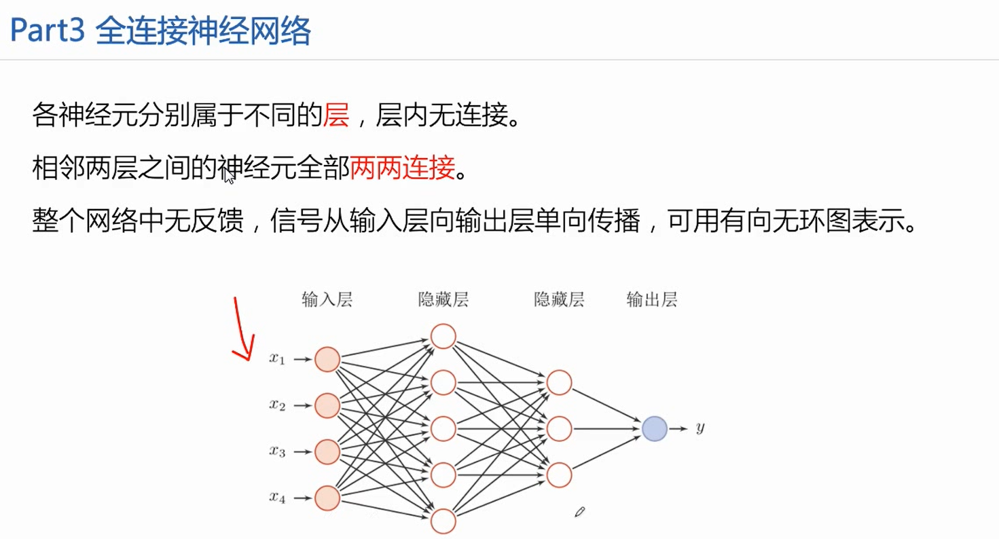

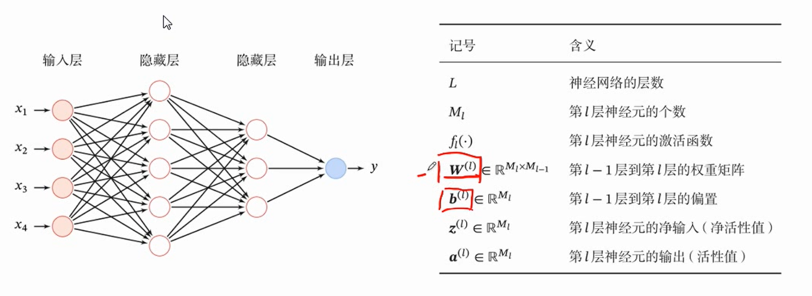

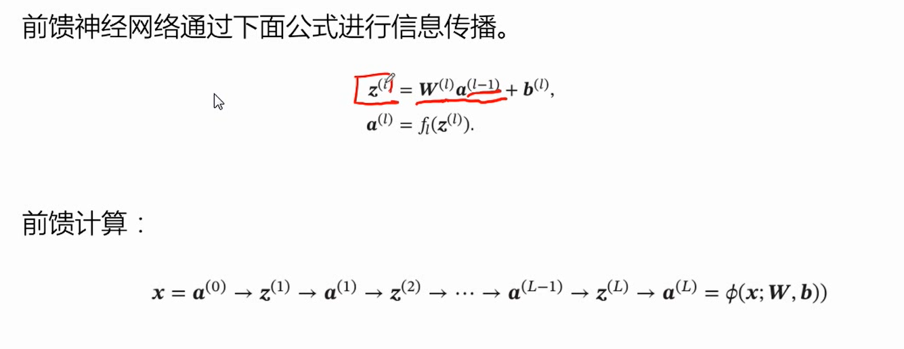

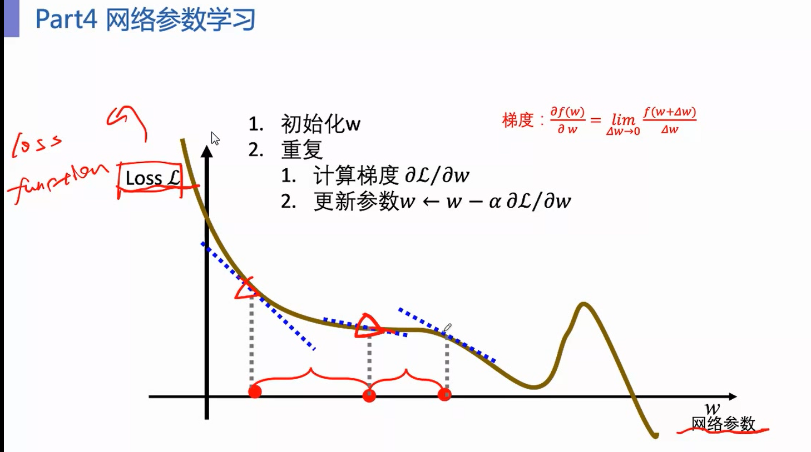

两种损失函数：

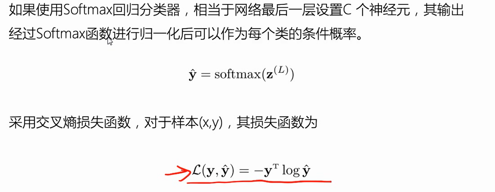

# a package is like a toolbox, there are mang interlayters in it.  pytorch is like this.

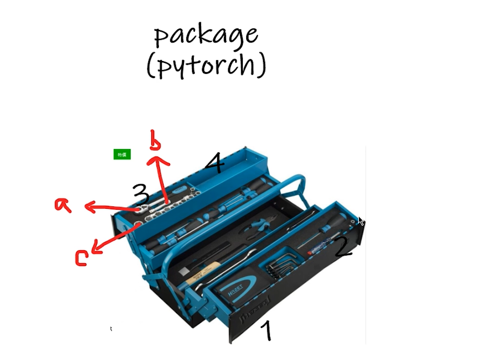

so there is two functions to help us to learning the box.

+ dir --look what contents are in the box
+ help -- learning the detail of the tools. ==attation! look up the detials,don't take parentheses!!==  加括号表示函数调用，不加括号表示函数本身

## 对 dataset、dataloader的了解

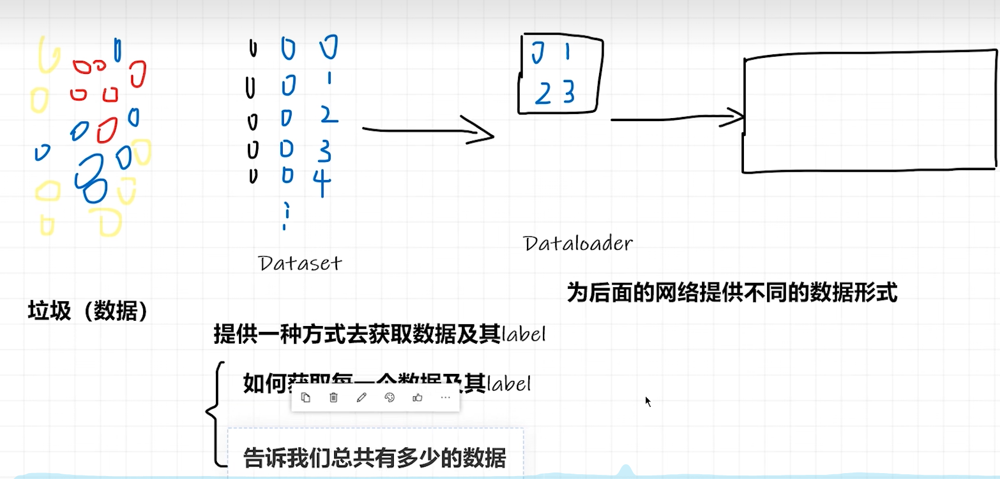

## one example:

the custom class must change  as the data struct change

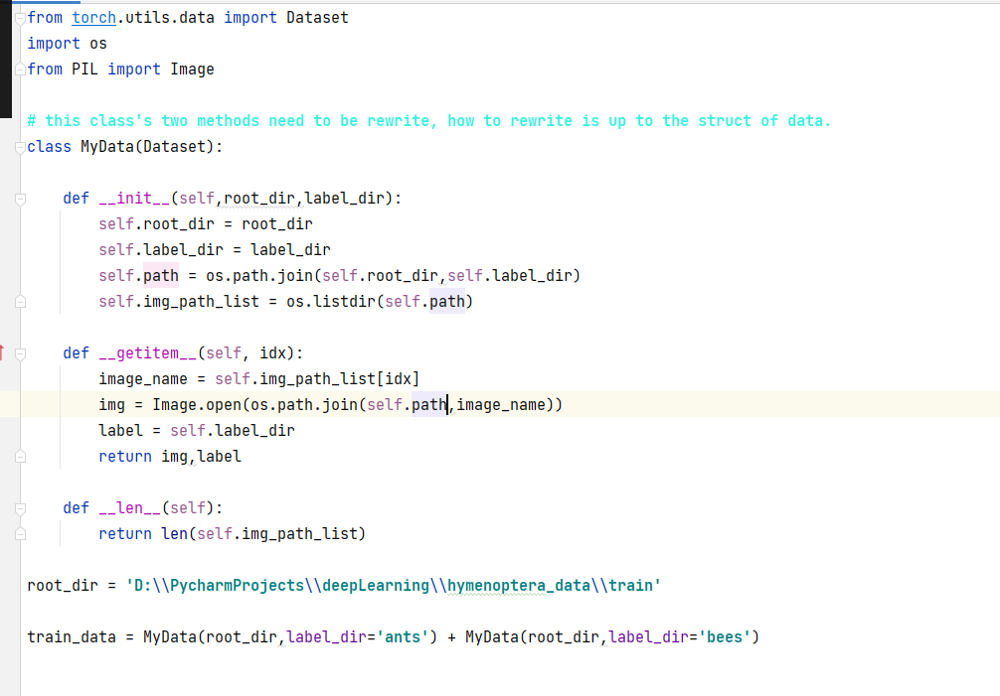

before introduce transform ,wo should learn the ==tensor== first.

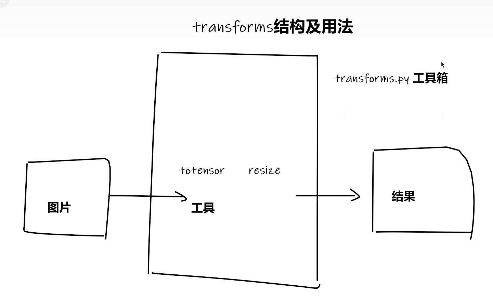

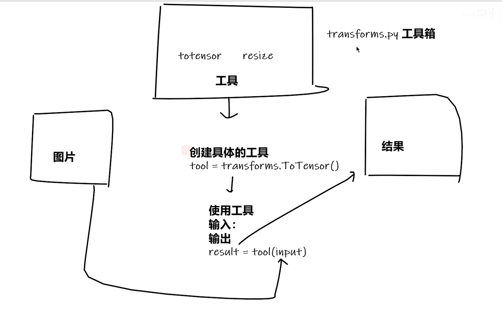

ctrl + p : in the pycharm can inform the parameters of the function

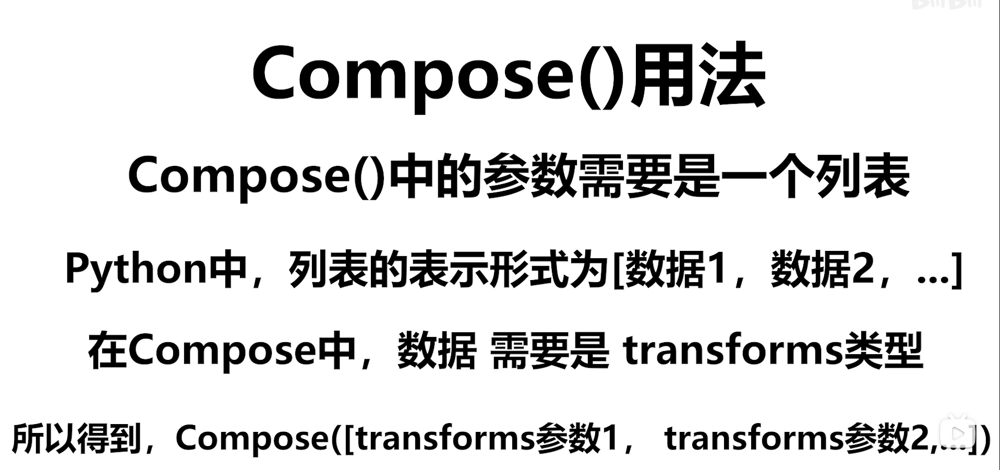

dataloader 's function is to get some contents from dataset. it is focus on 'get'

understand the convolution of piture

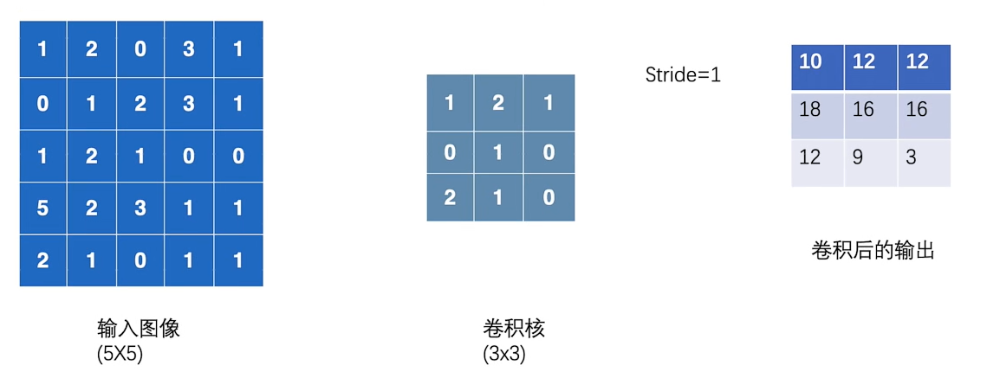

==notice: you only can use import to import a function、class、model(a file with suffix 'py'), but not a folder .==

liner layer

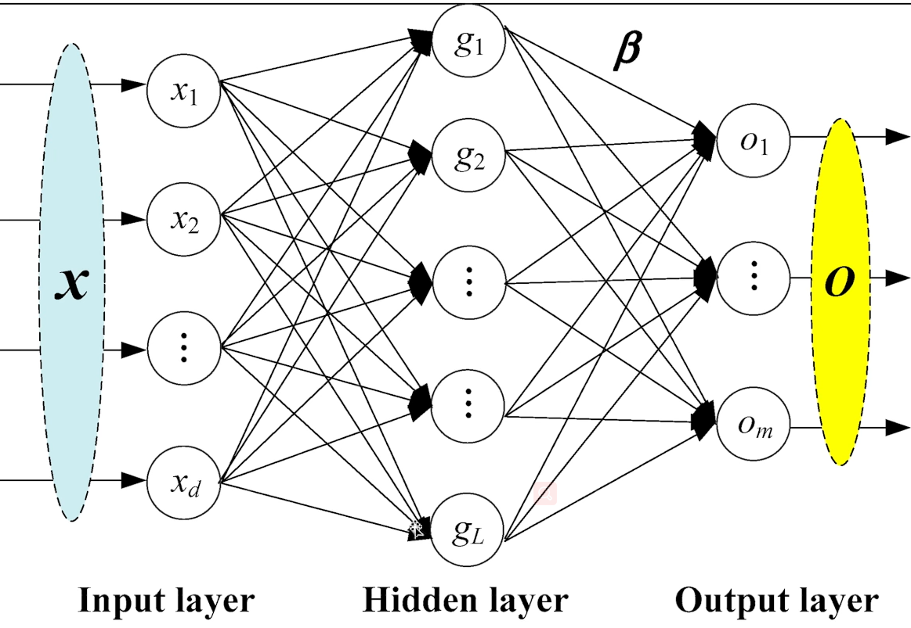

for one picture, wo should flatten the matrix.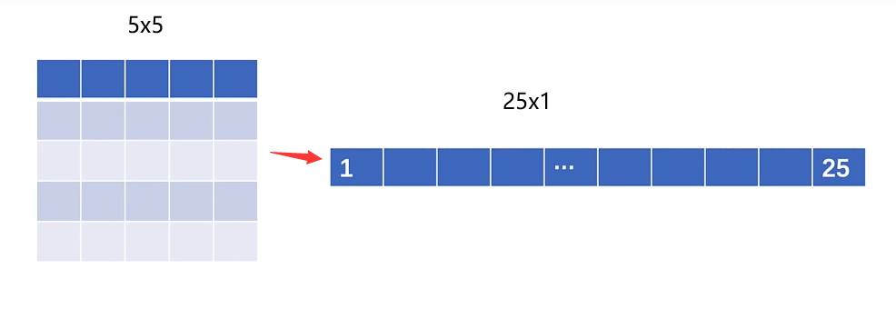

Pactice：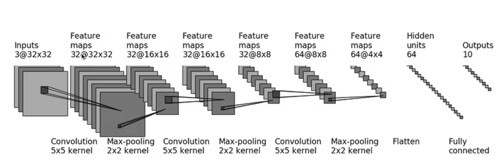

### loss function

