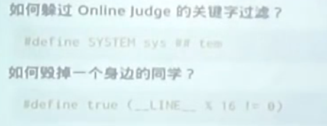

# 计算机基础

## 一、C语言：机制


更加了解 a.out 文件：

> 在vim 编辑器中输入 ":% ! xxd"
>
> 解释：% 表示全选中！！使用xxd命令

在Vim命令行下执行 `%!xdd` 将会使用外部命令 `xdd` 来处理当前编辑的文本。`xdd` 是一个十六进制转换工具，它可以将文本转换为十六进制表示。执行这个命令后，你的文本将会被转换为十六进制表示，并且显示在Vim编辑器中。

`%!` 是 Vim 中的一个命令，它用于执行外部命令并将当前编辑区域的内容传递给该命令。具体来说，`%!` 的作用是将当前编辑区域的文本作为标准输入传递给后面指定的命令，并将命令的输出替换当前编辑区域的内容。


现在想要了解文件编译运行的各个过程：

tldr  gcc

最后我们得到三个最重要的选项

+ -E
+ -S
+ -c

还有一个最重要的命令：

> objdump -d 

可以使二进制文件（a.o、a.out）反汇编


### 1.1 预编译

先来熟悉一下：

+ #include
+ #defind
+ #-----表示字符串话
+ ##-----表示字符串连接


当我们代码中语句：#include<stdio.h>

我们可以思考程序是如何找到stdio.h这个文件的？

！！！！方法：阅读命令的日志

> gcc --verbose a.c   (很多很多的命令都有verbose 这个选项)

我们使用man ssh,之后查询verbose可以找一找，看他支不支持：


这个说明了，一半尖括号都从哪里取找相应的文件！！！

当遇到问题在网上找不到解决问题时：：：：：：自己看 日志！！！！


下面继续介绍预编译：


预编译就是把 所有的==预编译指令== 都执行完

这一步完全就是 词法上------字符串上的处理！！！，这个和shell一样，也是字符串处理！！！	

因为所有的东西都是字符创的替换， 有一个特性，c语言所有预编译的变量都不需要定义就可以使用，我们举一个例子，这个例子是查看编译的方法：


因此，我们在 #if aa == bb,由于之前aa和bb都没有定义过，所以转换完后就相当于 空==空，一直是 返回true，所以预编译只剩下 print(YES)

还是那句话： 预编译就是字符串替换


理解理解上述的代码：！！！！！！

+ 首先 define TEN 当做一个 将 A 复制十遍的函数！！！，就是字符串的替换




讲一下：两个#号的用法：就是把两边的字符串粘成一个字符串；举例


这样就可以 造成一定的过滤！！！！！


> #define true (__LINE__ % 16 ! = 0)

__ LINE__ 是c++内置的一个宏，表示当前代码的行号


再来一个好玩的：


```c++
# define NAMES(X) \
X(TOM) X(JERRY) X(TYKE) X(SPIKE)

# include <stdio.h>
int main(){
	# define PRINT(X) printf("Helllo! "#X"!");
	NAMES(PRINT)
}
```

以上告诉我们，宏的参数，不仅仅可以使变量，还可以是 函数名，本质上，还是字符串的替换！！！ # 的作用就是将 变量转化为字符创，本来 TOM可能是一个变量名，但是我们加了#后变成了“”TOM“”

### 1.2 编译与链接

先看一段代码：

```c++
int foo(int n){
	int sum = 0;
	for(int i=1 ;i<= n;i++){
		sum += i;
	}
	return sum;
}
```

编辑器干的就是把上述c代码，编译成 汇编代码

```asm
.file   "a.c"
        .text
        .globl  foo
        .type   foo, @function
foo:
.LFB0:
        .cfi_startproc
        endbr64
        pushq   %rbp
        .cfi_def_cfa_offset 16
        .cfi_offset 6, -16
        movq    %rsp, %rbp
        .cfi_def_cfa_register 6
        movl    %edi, -20(%rbp)
        movl    $0, -8(%rbp)
        movl    $1, -4(%rbp)
        jmp     .L2
.L3:
        movl    -4(%rbp), %eax
        addl    %eax, -8(%rbp)
        addl    $1, -4(%rbp)
.L2:
        movl    -4(%rbp), %eax
        cmpl    -20(%rbp), %eax
        jle     .L3
        movl    -8(%rbp), %eax
        popq    %rbp
        .cfi_def_cfa 7, 8
        ret
        .cfi_endproc
.LFE0:
        .size   foo, .-foo
        .ident  "GCC: (Ubuntu 9.4.0-1ubuntu1~20.04.2) 9.4.0"
        .section        .note.GNU-stack,"",@progbits
        .section        .note.gnu.property,"a"
        .align 8
        .long    1f - 0f
        .long    4f - 1f
        .long    5
0:
        .string  "GNU"
1:
        .align 8
        .long    0xc0000002
        .long    3f - 2f
2:
        .long    0x3

```

后序会更加深入的了解


### 1.3 链接

a.c

```c++
int foo(int n){
	int sum = 0;
	for(int i=1 ;i<= n;i++){
		sum += i;
	}
	return sum;
}
```

b.c

```c++
int foo(int);
int main(){
    print("%d\n",foo(100));
}
```

执行指令：

1. gcc -c a.c -o a.o
2. gcc -c b.c -o b.o
3. gcc -static a.o b.o -o a.out


### 1.4 c程序执行的两个角度


最大的关键在于内存：内促那就是一个巨大的以字节为基本单位的数组！！！


**大招： C语言的一切都是指针！！！**

**C语言的一切都可以取地址！！！**


首先理解一下： void *---->这是一个纯粹的指针

而 int * ，首先这是一个纯粹的指针，其次表示其指向的内存为 int类型


上面ppt的输出：

来一段帮助理解C语言的程序：


指正与int类型操作，实际上，就是执行执行指向的下一个类型，加1等价于加上sizeof(object)


## 二、编程实践

核心准则：编写可读代码！！！

不可读 == 不可维护


首先 理解 typedef ：

+ 第一个作用就是：给一个已有的类型 起别名！！！
+ 第二个作用是：定义 自定义的函数指针！！！


对于 `typedef void (*sighandler_t)(int);`解释是：

用于声明一个名为`sighandler_t`的类型，该类型是一个指向接受一个`int`参数并返回`void`的函数指针的类型。！！！


为什么 不是所有的命令行程序 都支持 `ctrl+c` 来退出程序?

本质上这一行为 是有终端向进程发出一个ctrl+c相应的信号，而进程中可以定义

signal函数，来处理相应的信号！！！，这个就是那个人类可读版代码的出处！！！

### 2.1 降低维护成本

宏观：做好分解和解耦

另外记住： 程序首先是给人读的，其次才是给机器读的！！！（但不是说一定要有很多的注释，而是当别人读你的代码的时候，就是你想干嘛）


#### 2.1.1 实现 数字电路模拟器


可能现在我们的输入变量是XY，但是有可能未来会变成 XYZ，那时候该怎么办？

当真正项目很大的时候，你可能当需要添加一个变量时，你需要改几十处地方，到那时候你真的能全部该对吗？事实上很难做到！！！因此编写大的软件与编写小的软件的差别是很大的！！！

```c++
# include<stdio.h>
# include<unistd.h>

# define REGS_FOREACH(_) _(X) _(Y)

# define RUN_LOGIC  X1 = !X && Y;\
					Y1 = !X && !Y;

# define UPDATE(X) X = X##1;

# define DEFINE(X) static int X,X##1;
# define PRINT(X) printf(#X " = %d; ",X);


int main(){
	REGS_FOREACH(DEFINE);
    // 第一次展开
    // DEFINE(X) DEFINE(Y)
    // 第二次展开
    // static int X,X1; static int Y,Y1;
	while(1){
		RUN_LOGIC;
		REGS_FOREACH(PRINT);
		REGS_FOREACH(UPDATE)
		putchar('\n');sleep(1);
	}
	
}

```

小插曲 讲解一下python 中fileinput命令的用法！！：(可以很方便的使用这个包进行 文件、标准输入流的读取，方便实现 管道命令)

```wiki
是的，我熟悉fileinput模块，它是Python标准库中的一个模块，用于对文件进行迭代和编辑。fileinput模块提供了一种方便的方式来处理文本文件的输入，特别是当需要逐行读取文件、搜索和替换文本，以及处理多个文件时。

fileinput模块的主要功能包括：

逐行读取文件： 你可以使用fileinput.input()函数来创建一个迭代器，逐行读取一个或多个文件的内容。

自动处理多个文件： fileinput模块允许你指定多个文件名作为参数，然后自动迭代这些文件的内容，而无需手动打开和关闭文件。

搜索和替换文本： 你可以使用fileinput模块来搜索文件中的特定文本并进行替换，然后将结果写回原始文件或另存为新文件。

支持标准输入： 如果没有指定文件名参数，fileinput会自动从标准输入读取数据，这对于处理管道或重定向输入非常有用。

以下是一个简单示例，演示如何使用fileinput模块来逐行读取文件：

python
Copy code
import fileinput

# 使用fileinput.input()创建迭代器
for line in fileinput.input(files=("file1.txt", "file2.txt")):
    # 对每一行进行处理
    print(f"处理行: {fileinput.filelineno()} - 文件: {fileinput.filename()}")
    print(f"内容: {line.strip()}")

# 关闭迭代器（不是必需的，因为退出循环时会自动关闭）
fileinput.close()
这个示例将逐行读取file1.txt和file2.txt的内容，并在每一行上执行一些操作。fileinput模块还提供了其他功能，如搜索和替换文本以及更高级的文件编辑操作。如果你需要处理文本文件的输入和编辑，fileinput模块是一个强大且方便的工具。
```

#### 2.1.2 实现 数字电码管


```c++
# include <stdio.h>
# include<unistd.h>

# define REGS_FOREACH(_) _(X) _(Y)

# define OUTS_FOREACH(_) _(A) _(B) _(C) _(D) _(E) _(F) _(G)

# define RUN_LOGIC  X1 = !X && Y;\
					Y1 = !X && !Y; \
					A = (!X && !Y) || (X && !Y); \
					B = 1;\
					C = (!X && !Y) || (!X && Y);\
					D = (!X && !Y) || (X && !Y);\
					E = ( !X && !Y ) || (X && !Y);\
					F = ( !X && !Y ); \
					G = (X && !Y);

# define DEFINE(X) static int X,X##1;
# define UPDATE(X) X = X##1;
# define PRINT(X) printf(#X " = %d;",X);

int main(){
	REGS_FOREACH(DEFINE);
	OUTS_FOREACH(DEFINE);
	while(1){
		RUN_LOGIC;
		OUTS_FOREACH(PRINT);
		REGS_FOREACH(UPDATE);
		putchar('\n');
		fflush(stdout);
		sleep(1);
	}
	
}
```

另外一个处理程序 使用fileinput命令读取即可！！！


#### 2.1.3 实现 YEMU全系统模拟器


关键：需要对 字节的操作


 


上述代码可能非常容易理解！！！！

当红四存在一个很大的问题： 不可维护！！！！！


但是还可以更好：


下面对上述代码进行一定的解释：

+ 首先使用typedef定义了一种类型名为 inst_t
+ 之后使用了C语言提供的一种特性union
+ 我们知道 C语言中所有的变量都是指针，其指向的内存如何解释完全取决于对象的类型
+ 使用union达到一种效果：即inst_t这个类型的指针可以有很多种解释
+ `int a:4` 是C和C++语言中的位字段（bit field）声明，它表示创建一个名为 `a` 的整数变量，但限制了该变量的位数为4位（或者说只使用4个比特位来存储该变量的值）。这通常用于节省内存

使用老师的话来说：让代码变得好很简单，只需要让代码更加接近自然语言即可！！


然后在老师的举例中，我们学习到了一些，项目规范：

+ 所有的声明都在 一个头文件中搞，都混合在C语言代码中是不好的，这样的头文件就代表了整个项目的设计，


## 三、框架代码：编译运行

### 3.1 git&github


github不仅仅是一个 巨大的代码聚集地，他还是一个最佳的代码学习平台！！！（今天才知道）


使用awesome + 我们要学习的语言  即可 搜到我们需要的学习资料


用好社区 使我们整个 本科生涯最重要的 事情


中文社区和英文社区的隔离是非常严重的！！！！！

+ 屏蔽baidu
+ 使用英文关键词


提出一个非常好的git手册：

### 3.2 git讲解

我们在一般的 代码  调式，可能会添加许多的printf，而这很可能破坏代码本身的特性，所以就提出了`快照`，可以帮助我们在未来的某个时刻可以回到以往！！！而快照都应该有一个名字，因此我们在 git中看到的 commit 后面加上的一串值 就是 快照的名称


git就是对当前目录做了一个扩展：

+ 当前目录叫做 working direrctory, 你对当前目录做的任何操作git都不会管，直到你执行 gir add命令，可以帮当前目录中的全部或者部分文件`加到`一个临时快照里面（注意用词是添加！！！）
+ 之后通过git commit 将这一个临时快照永久的加到我们的快照历史当中！！！即 History
+ 所以总结git的功能：就是不断对 文件做快照！！！

上述所有的内容都是保存在一个叫`.git`的文件目录中！！


可以实现 两个用户 同时 获取到一个项目的同一份 快照到本地， 然后分别在本地进行 编写，知道有一天，两者需要将各自的代码进行合并：

+ 这就形成一种分布式协作的形式
+ 一个学习git的有趣网址：https://learngitbranching.js.org/
+ 提供一种功能：只对选择的部分文件做快照：`.gitignore`文件中可以设置在这张图中的意思是：忽略了所有的文件，除了一些白名单上的文件
+ git clone 命令，是将整个项目以及项目的git一块克隆到本地，包括项目的一些快照


下面将一些不太常用的应用：

1. 提交脚本：可以看到里面的makefile文件，


### 3.3 make工具！！！


一个makefile所做的事情非常简单：描述一个有向无环图， 里面有各个节点对象，他描述了各个节点对象的依赖关系，也就是说我想要建立当前对象，我就必须先生成那些对象（换成人话：你给makefile描述一个有向无环图，他会给你按照一个拓扑排序的形式帮你进行编译）：

第一次编译当然整个路径上的文件都会被编译，最后返回路径上生成的中间文件以及最后需要的总的文件；如果紧接着没修改任何一个文件，我们就开始在运行makefile，那么会告诉你 没必要再次进行编译，直接使用上一次的结果，如果你修改了任意一个文件，那么运行makefile之后也只会影响相应路径上的编译！！！而不是将所有的过程都重新编译一次！！！	

这是老师上课的时候的三次运行make命令的结果。

因此这是一个很有必要的工具，特别是当一个项目非常大的时候！！！！，可以减少大幅减少每次编译的时间！！！


谈到有向无环图，那我们就有思路了，首先我们将所有的文件 进行拓扑排序：之后根据拓扑排序的顺序进行编译；

如果 图中的两个节点无任何关系，那么我们可以并行编译项目！！！！  当然make已提供了这个选项 -j 8：表示启动八个线程进行同时编译（而make工具已经正确得帮助我们设计好了编译顺序了）


下面我们进行详细的讲解makefile文件：


+ $(shell xxx) 实际上就是 表示在shell里面执行 xxx 命令
+ 有一点小小的区别，在makefile里面所有的变量都有 （）包裹，然而在shell中就不需要了，所以真正在bash里面执行得就是basename $PWD
+ 其次，我们有一个编译目标对象 叫all，他依赖于两个目标：$(NAME)-64 和 $(ANME)-32
+ 最后的include 和C语言中的include命令完全相同，意思是将../目录下的makefile加进来一起执行


`make -nB` 执行可以帮助我们更好地理解 makefile命令，-n的作用是，把所有要执行的脚本都打印出来（直接看makefile可能看不懂，但是我们可以反过来，先看看makefile执行了那些文件，之后再看makefile文件）


-在linux世界里，表示从标准输入出中取东西！！！

vim的 命令行一些小技巧：

在Vim的命令行中，`!` 和 `%` 是两个特殊字符，具有不同的含义和功能：

1. `!`：在Vim的命令行中，`!`（感叹号）通常用于执行外部命令或过滤文本。
   - 你可以使用 `:!` 后跟外部命令来在Vim中执行该命令。例如，`:!ls` 会在Vim中运行 `ls` 命令，显示当前目录的文件列表。
   - 你还可以使用 `:!` 后跟一个命令来过滤文本。例如，如果你选择了一些文本并在命令行中输入 `:'<,'>!sort`，它将对所选文本进行排序并将结果替换为原始文本。
2. `%`：在Vim的命令行中，`%`（百分号）表示当前文件的名称。它通常用于与文件名相关的操作。
   - 你可以在命令行中使用 `%` 来表示当前打开的文件。例如，如果要保存当前文件，你可以在命令行中输入 `:w %`，它将保存当前文件。
   - `%` 还可以在替换命令中使用。例如，要在当前文件中将所有匹配的字符串替换为另一个字符串，可以使用 `:%s/old_string/new_string/g`，其中 `%` 表示在整个文件中进行替换操作。


可以在vim的命令行中 对内容进行替换以及删除：

+ 替换：:%s/old_string/new_string/g
+ 删除：:%s/old_string//g


## 四、代码框架：代码导读

看到一个非常适合学习技巧的网站：https://missing.csail.mit.edu/


