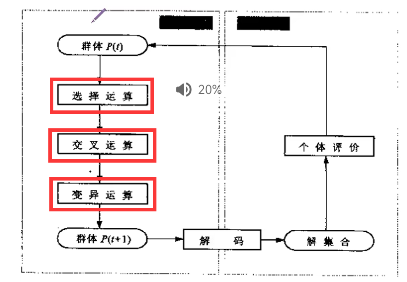

# 遗传算法

## 用途：

解决最优化问题的一种搜索算法

## 基本步骤：

其中最终要的三步：

​			选择运算，交叉运算，变异运算

## 预备知识：

个体代表一个具体的解  种群代表解的集合

为了 交叉、变异的方便，我们又引入了编码解码的概念

编码：将数字映射到 二进制字符串，二进制的长度我们称之为DNA长度，

解码：将二进制字符串映射到整数

以上两步骤本质就是将一个整数从一个区间映射成相应DNA长度的二进制字符串，而这个相应DNA长度二进制串也能表示一个整数范围：[0~2^len(DNA)-1]。因此

==问题就成了从一个大整数区间到一个小数区间映射的问题，在大整数区间中取值只能为整数，而在小区间内取值可以是非整数！！！！例如我们将一个小区间分割成2^len(DNA)个格子，这样就能形成一种映射了，又或者将先将大整数映射到0-1中，在做计算==

适应度：计算每个个体的适应度，同时选择K个适应度高的个体保留，我们这里不是选择适应度最高的K个，而是按照适应度大小计算概率大小进行选择，目的是防止陷入局部最优解！！！

之后就是利用筛选出来的最优解，之间进行交叉与变异。==注意：交叉的概率0.6~1，变异的概率要比0.1小==  

